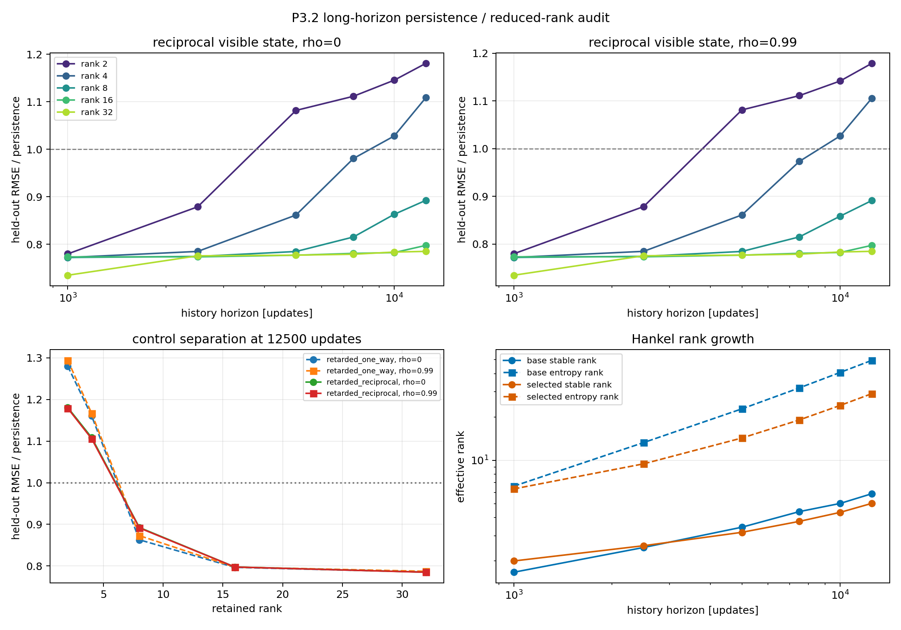

# P3.2 long-horizon Hankel and persistence gate

Date: 2026-08-04T18:39:25+00:00.

## Design

The fixed P3.2 checkpoint, kernel, lambda, epsilon, gain, distance, and
Telegraph mediator are unchanged. The visible (x-minus,m-minus) delay
ladder and the field/momentum-augmented ladder use depths 1,2,5,10,20
at 0.5-memory-time cadence with one common chronological 60/40 holdout.
Only held-out visible/memory prediction is scored against persistence.

Node-noise marginals remain fixed while rho = 0, 0.9, 0.99 changes only
relative noise. Channel-off, instantaneous reciprocal, and retarded
one-way remain controls. All paths continue one formation checkpoint.

## Registered result

Classification: **predictive closure candidate; spectrum non-identifiable**.

- augmented predictive closure: 9/9;
- augmented spectral identifiability: 0/9;
- augmented complex candidates: 0/9;
- controls bounded: True;
- relative-noise unmasking candidate: False.

The registered augmented spectrum is therefore inconclusive, not a
complex-mode null: its terminal design matrices are rank-deficient or
near-rank-deficient (condition 1.634e+16..1.889e+16).

## Reconciliation

The visible delay layer is substantially better identified:

- visible predictive closure: 9/9;
- visible spectral identifiability: 9/9, condition 54.5..64.5;
- visible depth-stable matching segments: 0/36;
- visible complex candidates: 0/9.

Adding target field and momentum readouts does not improve held-out
prediction relative to the visible delay ladder: gain -0.129%..0.0454%.
The augmented fits nevertheless match complex poles in 35/36
segments. Because these poles occur with severe rank deficiency and the
inserted Telegraph channel already contains complex internal poles,
they are not identifiable knot modes.

The separate full ambient AR(1) fit is also not control-separated:
complex in 9/9 retarded-reciprocal paths and 9/9
channel-off paths. It supplies no ambient-rotation candidate.

## Relative noise

The observed node RMS remains 0.8174..0.8191 R
around the expected 0.8183 R.
- rho=0: relative RMS 0.578..0.5789 R (expected 0.5787 R), mean final reciprocal distance 0.6064 R;
- rho=0.9: relative RMS 0.1828..0.1831 R (expected 0.183 R), mean final reciprocal distance 0.1918 R;
- rho=0.99: relative RMS 0.0578..0.05789 R (expected 0.05787 R), mean final reciprocal distance 0.06064 R;

Lower relative diffusion strengthens binding but leaves the closure
curves nearly unchanged. This is not evidence for an unmasked
oscillation.

| seed | rho | visible ratio | augmented ratio | augmented gain | condition | matching segments | relative noise/R | final distance/R |
| ---: | ---: | ---: | ---: | ---: | ---: | ---: | ---: | ---: |
| 1 | 0 | 0.7265 | 0.7274 | -0.125% | 1.763e+16 | 4 | 0.578 | 0.647 |
| 1 | 0.9 | 0.7265 | 0.7274 | -0.125% | 1.889e+16 | 4 | 0.1828 | 0.2046 |
| 1 | 0.99 | 0.7264 | 0.7273 | -0.125% | 1.640e+16 | 4 | 0.0578 | 0.0647 |
| 2 | 0 | 0.7399 | 0.7395 | 0.0454% | 1.733e+16 | 3 | 0.5789 | 0.8553 |
| 2 | 0.9 | 0.7398 | 0.7395 | 0.0444% | 1.822e+16 | 4 | 0.1831 | 0.2705 |
| 2 | 0.99 | 0.7395 | 0.7392 | 0.0403% | 1.634e+16 | 4 | 0.05789 | 0.08553 |
| 3 | 0 | 0.733 | 0.7339 | -0.126% | 1.834e+16 | 4 | 0.5789 | 0.3169 |
| 3 | 0.9 | 0.733 | 0.734 | -0.127% | 1.834e+16 | 4 | 0.1831 | 0.1002 |
| 3 | 0.99 | 0.733 | 0.7339 | -0.129% | 1.659e+16 | 4 | 0.05789 | 0.03169 |

## Long-horizon reduced-rank follow-up

The fixed delay ladder [20, 50, 100, 150, 200, 250] corresponds to history horizons
1000..12500 updates at unchanged
50-update cadence. Fixed retained ranks are [2, 4, 8, 16, 32]. Every depth
uses identical train-target and held-out target times; only the amount
of represented history changes.

Registered trend classification: **longer history degrades held-out prediction**.

The median terminal-minus-initial prediction ratio is 0.1203; the fractions of
positive/negative pathwise changes are 1/0. A material change required an
absolute ratio shift of at least 0.02
with at least 80% sign agreement.

| rho | rank | reciprocal start | reciprocal terminal | delta | one-way terminal |
| ---: | ---: | ---: | ---: | ---: | ---: |
| 0 | 2 | 0.7797 | 1.181 | +0.401 | 1.28 |
| 0 | 4 | 0.7721 | 1.109 | +0.3365 | 1.16 |
| 0 | 8 | 0.7722 | 0.8924 | +0.1203 | 0.8629 |
| 0 | 16 | 0.7734 | 0.7976 | +0.02418 | 0.7966 |
| 0 | 32 | 0.7347 | 0.785 | +0.05026 | 0.7853 |
| 0.9 | 2 | 0.7798 | 1.181 | +0.401 | 1.279 |
| 0.9 | 4 | 0.7721 | 1.109 | +0.3365 | 1.163 |
| 0.9 | 8 | 0.7722 | 0.8926 | +0.1204 | 0.8662 |
| 0.9 | 16 | 0.7735 | 0.7977 | +0.02425 | 0.7971 |
| 0.9 | 32 | 0.7348 | 0.7851 | +0.05029 | 0.786 |
| 0.99 | 2 | 0.7797 | 1.179 | +0.3992 | 1.294 |
| 0.99 | 4 | 0.772 | 1.106 | +0.3338 | 1.167 |
| 0.99 | 8 | 0.7721 | 0.8914 | +0.1192 | 0.8729 |
| 0.99 | 16 | 0.7734 | 0.7974 | +0.02404 | 0.7972 |
| 0.99 | 32 | 0.7347 | 0.7849 | +0.05015 | 0.7872 |

At the terminal horizon, median stable/entropy ranks are 5.87/49.4 for the visible state and 5.03/29 for the field/momentum-augmented state. At the initial horizon these were 1.67/6.62 and 2/6.33.

All registered path/rank deltas are positive. The high-rank terminal
reciprocal-minus-one-way ratio difference spans -0.00366..0.002435; therefore the degradation is
not separated from the one-way mediator control. Field/momentum readouts
also do not reverse the long-history degradation.

The supported interpretation is fixed-rank information dilution while
the sampled stochastic history adds effective directions. This is not
evidence for a longer physical persistence scale or a closed oscillatory
state.

Reduced DMD poles are stored for audit but are not promoted to a mode
result here. Rank-, depth-, segment-, and one-way-control stability is
still required before spectral interpretation.

## Boundary and decision

A passed predictive gate is cadence- and horizon-specific, not an exact
Markov theorem. The complete mediator grid remains hidden. The current
data support a well-conditioned visible delay-state null at the
registered cadence, but not an augmented-system null.

This completes the common-window long-history prediction and rank
stage. The remaining spectral step is a preregistered pole-identity
audit across fixed ranks, delay depths, time segments, and the one-way
control; no gain, lambda, epsilon, or kernel retuning is allowed.

No spin, d=3 selection, particle, photon, Lorentz, QFT, or
Standard-Model claim follows.

## Reproducibility

- checkpoint: data/processed/reference_states/scalar_Aatt35_N100M_d3_d10_seed1_2026-07-16/scalar_Aatt35_d3_seed1_N100000000.npz;
- git revision: d1c7a03b207d93b9ab5330db0ffef57cc9c17515;
- git status at start: clean;
- runtime: 1056.588 s;
- command: python experiments/current/memory/synchronization/measurement_closure_relative_noise_gate.py;
- [machine-readable summary](long_horizon_hankel_gate_2026-08-04.json).
