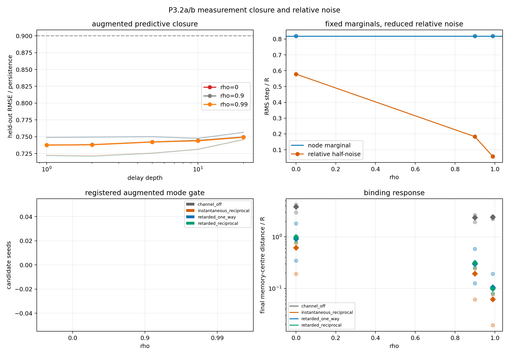

# P3.2a/b measurement closure and relative-noise gate

Date: 2026-08-04T15:33:47+00:00.

## Design

The fixed P3.2 checkpoint, kernel, lambda, epsilon, gain, distance, and
Telegraph mediator are unchanged. The visible (x-minus,m-minus) delay
ladder and the field/momentum-augmented ladder use depths 1,2,5,10,20
at 0.5-memory-time cadence with one common chronological 60/40 holdout.
Only held-out visible/memory prediction is scored against persistence.

Node-noise marginals remain fixed while rho = 0, 0.9, 0.99 changes only
relative noise. Channel-off, instantaneous reciprocal, and retarded
one-way remain controls. All paths continue one formation checkpoint.

## Registered result

Classification: **predictive closure candidate; spectrum non-identifiable**.

- augmented predictive closure: 9/9;
- augmented spectral identifiability: 0/9;
- augmented complex candidates: 0/9;
- controls bounded: True;
- relative-noise unmasking candidate: False.

The registered augmented spectrum is therefore inconclusive, not a
complex-mode null: its terminal design matrices are rank-deficient or
near-rank-deficient (condition 1.550e+16..1.930e+16).

## Reconciliation

The visible delay layer is substantially better identified:

- visible predictive closure: 9/9;
- visible spectral identifiability: 9/9, condition 46.8..81;
- visible depth-stable matching segments: 0/36;
- visible complex candidates: 0/9.

Adding target field and momentum readouts does not improve held-out
prediction relative to the visible delay ladder: gain -1.94%..0.201%.
The augmented fits nevertheless match complex poles in 33/36
segments. Because these poles occur with severe rank deficiency and the
inserted Telegraph channel already contains complex internal poles,
they are not identifiable knot modes.

The separate full ambient AR(1) fit is also not control-separated:
complex in 9/9 retarded-reciprocal paths and 6/9
channel-off paths. It supplies no ambient-rotation candidate.

## Relative noise

The observed node RMS remains 0.8178..0.8203 R
around the expected 0.8183 R.
- rho=0: relative RMS 0.5777..0.5802 R (expected 0.5787 R), mean final reciprocal distance 0.9462 R;
- rho=0.9: relative RMS 0.1827..0.1835 R (expected 0.183 R), mean final reciprocal distance 0.2992 R;
- rho=0.99: relative RMS 0.05777..0.05802 R (expected 0.05787 R), mean final reciprocal distance 0.09462 R;

Lower relative diffusion strengthens binding but leaves the closure
curves nearly unchanged. This is not evidence for an unmasked
oscillation.

| seed | rho | visible ratio | augmented ratio | augmented gain | condition | matching segments | relative noise/R | final distance/R |
| ---: | ---: | ---: | ---: | ---: | ---: | ---: | ---: | ---: |
| 1 | 0 | 0.7481 | 0.7496 | -0.201% | 1.930e+16 | 4 | 0.5802 | 0.9912 |
| 1 | 0.9 | 0.748 | 0.7495 | -0.198% | 1.876e+16 | 4 | 0.1835 | 0.3135 |
| 1 | 0.99 | 0.7477 | 0.7491 | -0.185% | 1.780e+16 | 4 | 0.05802 | 0.09912 |
| 2 | 0 | 0.7333 | 0.7453 | -1.63% | 1.926e+16 | 3 | 0.5783 | 0.8068 |
| 2 | 0.9 | 0.733 | 0.7457 | -1.73% | 1.860e+16 | 3 | 0.1829 | 0.2551 |
| 2 | 0.99 | 0.732 | 0.7463 | -1.94% | 1.916e+16 | 3 | 0.05783 | 0.08068 |
| 3 | 0 | 0.7576 | 0.756 | 0.201% | 1.641e+16 | 4 | 0.5777 | 1.04 |
| 3 | 0.9 | 0.7577 | 0.7566 | 0.147% | 1.555e+16 | 4 | 0.1827 | 0.329 |
| 3 | 0.99 | 0.7575 | 0.7568 | 0.0985% | 1.550e+16 | 4 | 0.05777 | 0.104 |

## Boundary and decision

A passed predictive gate is cadence- and horizon-specific, not an exact
Markov theorem. The complete mediator grid remains hidden. The current
data support a well-conditioned visible delay-state null at the
registered cadence, but not an augmented-system null.

The next measurement step is a preregistered reduced-rank/Hankel audit
of the already chosen observables, not a gain, lambda, epsilon, or
kernel sweep. Any retained pole must remain stable across rank and
time segments and separate from the one-way mediator control.

No spin, d=3 selection, particle, photon, Lorentz, QFT, or
Standard-Model claim follows.

## Reproducibility

- checkpoint: data/processed/reference_states/scalar_Aatt35_N100M_d3_d10_seed1_2026-07-16/scalar_Aatt35_d3_seed1_N100000000.npz;
- git revision: b296d6667d4307ad785df154be3c6e3e7e502bbb;
- git status at start: clean;
- runtime: 333.599 s;
- command: python experiments/current/memory/synchronization/measurement_closure_relative_noise_gate.py;
- [machine-readable summary](measurement_closure_relative_noise_gate_2026-08-04.json).
