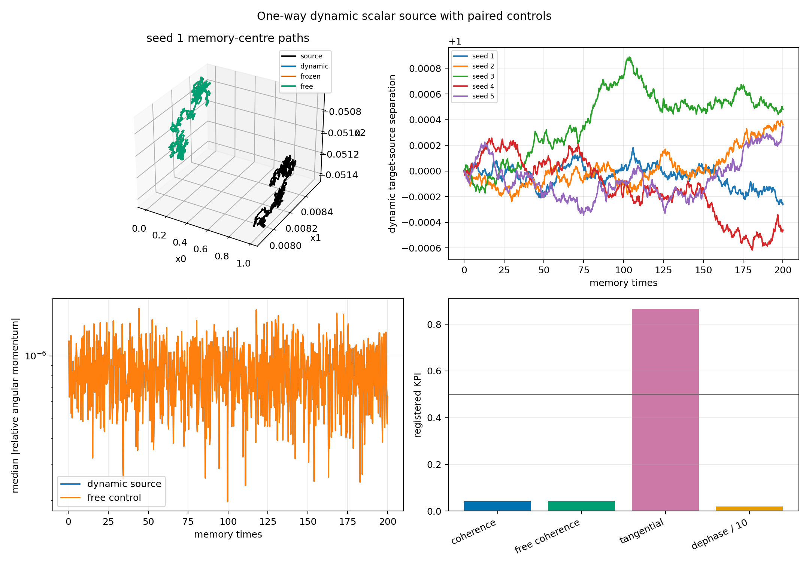

# One-Way Dynamic Scalar-Source Pilot

Date: 2026-07-20T06:28:56.937247+00:00.

## Question

Does an autonomously moving scalar-memory source produce a relational
translation or coherent orbital mode in a second knot beyond frozen-source
and no-cross controls?

## Design

- One N=100M d=3 checkpoint is cloned into target and source.
- The source evolves under self-memory and independent future noise.
- External source launch: 0 sigma_rep over 10 memory times.
- The launch is an imposed probe, not emergent source propulsion.
- The source does not read the target.
- Dynamic-source, frozen-source, free, and eta=0 target paths share target noise.
- cross_eta is calibrated once to 0.03 target radii per memory time initially.
- Continuation seeds sample future noise, not independent formation basins.

## Registered gate

- Exact cross=0 identity: True (max error 0.000e+00).
- Dynamic-versus-frozen source readout above 0.1 target radius: False.
- Launch-specific source displacement: 0.000 knot radii.
- Launch-specific target readout above 0.1 target radius: False (0.000e+00 radii).
- Target radius disturbance below 10 percent: True.
- Additional source-radius disturbance versus the paired unlaunched path below 10 percent: True.
- Median dynamic angular coherence: 0.042 (free 0.042).
- Median tangential fraction: 0.865.
- Median dephasing time: 0.200 memory times.
- Relational phase candidate: False.

## Seed rows

| continuation seed | source displacement / R | launch source / R | launch target / R | dynamic-frozen / R | max source radius effect | max target radius disturbance |
|---:|---:|---:|---:|---:|---:|---:|
| 1 | 2.132 | 0.000 | 0.000e+00 | 0.000 | 0.000e+00 | 1.632e-04 |
| 2 | 2.547 | 0.000 | 0.000e+00 | 0.000 | 0.000e+00 | 1.511e-04 |
| 3 | 1.646 | 0.000 | 0.000e+00 | 0.000 | 0.000e+00 | 1.677e-04 |
| 4 | 4.468 | 0.000 | 0.000e+00 | 0.000 | 0.000e+00 | 1.512e-04 |
| 5 | 3.308 | 0.000 | 0.000e+00 | 0.000 | 0.000e+00 | 1.573e-04 |

## Interpretation limits

- This is an instantaneous unsigned scalar cross-channel.
- A moving-source response is not finite-speed propagation.
- Continuation seeds from one checkpoint are not independent knot types.
- Nonzero angular momentum amplitude without orientation coherence and
  control separation is stochastic bending, not spin or orbit.
- No charge, photon, synchronization, or Standard-Model claim follows.

## Reproduction

    python experiments/current/memory/synchronization/one_way_dynamic_source_pilot.py

Git revision: 12316921fafd1afabe4e8a26f4521e4aeb45b5f0.
Git status at generation: clean.
