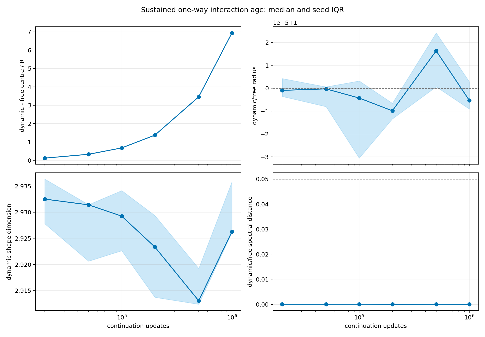

# One-Way Interaction-Age Audit

Date: 2026-07-20T22:38:28.010269+00:00.

## Question

Does a mature target develop a slowly emerging, control-separated shape
under the sustained field of a second autonomously evolving scalar knot?

## Design

- Start checkpoint: N=100,000,000.
- Final state age: N=101,000,000.
- Evaluations: [20000, 50000, 100000, 200000, 500000, 1000000] updates.
- Trailing window: 5,000 updates.
- Every N point comes from one common-prefix continuation per seed.
- Dynamic-source, frozen-source, free and eta-zero targets share noise.
- This is one-way sustained-field adaptation, not reciprocal formation.

## Registered decision gate

- Mature source stationary: True (5/5).
- Shape plateau from the penultimate to final age: True (5/5).
- Interaction-modified shape at final age: False (0/5).
- Stable interaction-modified shape candidate: False.
- Final dynamic-free centre response: 6.931 R.
- Final dynamic-frozen centre difference: 0.01897 R.
- Final dynamic/free radius ratio: 0.99999.
- Final shape-dimension difference: 0.00001.
- Final spectral-shape distance: 0.00005.
- Centre-response OLS slope: 6.94819e-06 R/update (R^2=0.99999992).
- Linear scale estimate: one R per 143,922 updates; one kernel width after about 679,990,642 updates.

## N dependence

| continuation N | centre / R | radius ratio | dynamic D_shape | D_shape difference | spectral distance |
|---:|---:|---:|---:|---:|---:|
| 20,000 | 0.1223 | 1.00000 | 2.9325 | -0.0000 | 0.0001 |
| 50,000 | 0.3308 | 1.00000 | 2.9314 | -0.0000 | 0.0001 |
| 100,000 | 0.6784 | 1.00000 | 2.9292 | -0.0000 | 0.0001 |
| 200,000 | 1.373 | 0.99999 | 2.9233 | 0.0000 | 0.0000 |
| 500,000 | 3.459 | 1.00002 | 2.9131 | -0.0000 | 0.0001 |
| 1,000,000 | 6.931 | 0.99999 | 2.9263 | 0.0000 | 0.0000 |

## Interpretation limits

- A stable shape difference is an effective-state candidate, not a new
  particle type, quantum number or reciprocal bound state.
- Five continuation seeds share one formation checkpoint and therefore
  sample future noise, not independent formation basins.
- If the last two ages do not plateau, extend N before changing parameters.
- If they plateau without a control-separated shape, longer waiting under
  this same channel is not the next priority.
- The six age windows test slow monotone adaptation. They do not exclude
  every breathing or orbital period above 1e5 updates; that question needs
  a regularly sampled paired difference trace and a registered spectral
  test rather than another sparse endpoint extension.
- The kernel-width time is a linear scale extrapolation, not a prediction
  that the measured slope or knot identity persists to that age.

Runtime: 907.1 seconds.
Git revision: ae79460be245529226cba25783b68b8d966e1560.
Git status at generation: clean.
