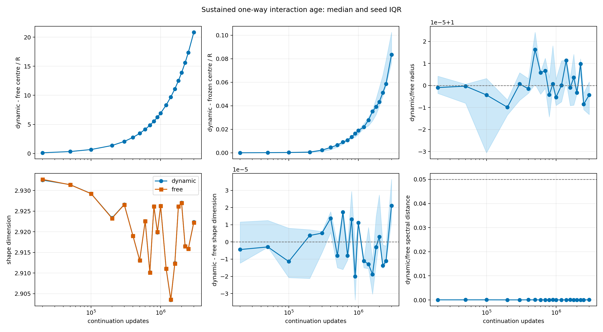

# One-Way Interaction-Age Audit

Date: 2026-07-21T13:04:27.774105+00:00.

## Question

Does a mature target develop a slowly emerging, control-separated shape
under the sustained field of a second autonomously evolving scalar knot?

## Design

- Start checkpoint: N=100,000,000.
- Final state age: N=103,000,000.
- Evaluations: [20000, 50000, 100000, 200000, 300000, 400000, 500000, 600000, 700000, 800000, 900000, 1000000, 1200000, 1400000, 1600000, 1800000, 2000000, 2250000, 2500000, 3000000] updates.
- Trailing window: 5,000 updates.
- Every N point comes from one common-prefix continuation per seed.
- Dynamic-source, frozen-source, free and eta-zero targets share noise.
- This is one-way sustained-field adaptation, not reciprocal formation.

## Registered decision gate

- Mature source stationary: True (5/5).
- Shape plateau from the penultimate to final age: True (5/5).
- Interaction-modified shape at final age: False (0/5).
- Stable interaction-modified shape candidate: False.
- Final dynamic-free centre response: 20.84 R.
- Final dynamic-frozen centre difference: 0.08360 R.
- Final dynamic/free radius ratio: 1.00000.
- Final shape-dimension difference: 0.00002.
- Final spectral-shape distance: 0.00006.
- Centre-response OLS slope: 6.95235e-06 R/update (R^2=0.99999991).
- Linear scale estimate: one R per 143,836 updates; one kernel width after about 679,583,485 updates.
- Dynamic/free shape-dimension correlation across ages: 0.999953.
- Paired/absolute shape-span ratio: 0.001420.

## N dependence

| continuation N | centre / R | radius ratio | dynamic D_shape | D_shape difference | spectral distance |
|---:|---:|---:|---:|---:|---:|
| 20,000 | 0.1223 | 1.00000 | 2.9325 | -0.0000 | 0.0001 |
| 50,000 | 0.3308 | 1.00000 | 2.9314 | -0.0000 | 0.0001 |
| 100,000 | 0.6784 | 1.00000 | 2.9292 | -0.0000 | 0.0001 |
| 200,000 | 1.373 | 0.99999 | 2.9233 | 0.0000 | 0.0000 |
| 300,000 | 2.068 | 1.00000 | 2.9266 | 0.0000 | 0.0000 |
| 400,000 | 2.763 | 1.00000 | 2.9190 | 0.0000 | 0.0001 |
| 500,000 | 3.459 | 1.00002 | 2.9131 | -0.0000 | 0.0001 |
| 600,000 | 4.156 | 1.00001 | 2.9226 | 0.0000 | 0.0001 |
| 700,000 | 4.85 | 1.00001 | 2.9102 | -0.0000 | 0.0001 |
| 800,000 | 5.543 | 1.00000 | 2.9261 | 0.0000 | 0.0000 |
| 900,000 | 6.237 | 1.00000 | 2.9199 | -0.0000 | 0.0001 |
| 1,000,000 | 6.931 | 0.99999 | 2.9263 | 0.0000 | 0.0000 |
| 1,200,000 | 8.323 | 1.00000 | 2.9110 | -0.0000 | 0.0000 |
| 1,400,000 | 9.714 | 1.00001 | 2.9035 | -0.0000 | 0.0000 |
| 1,600,000 | 11.1 | 1.00000 | 2.9124 | -0.0000 | 0.0001 |
| 1,800,000 | 12.5 | 1.00000 | 2.9261 | -0.0000 | 0.0000 |
| 2,000,000 | 13.89 | 1.00000 | 2.9271 | 0.0000 | 0.0001 |
| 2,250,000 | 15.62 | 1.00001 | 2.9165 | -0.0000 | 0.0001 |
| 2,500,000 | 17.36 | 0.99999 | 2.9159 | -0.0000 | 0.0001 |
| 3,000,000 | 20.84 | 1.00000 | 2.9224 | 0.0000 | 0.0001 |

## Interpretation limits

- A stable shape difference is an effective-state candidate, not a new
  particle type, quantum number or reciprocal bound state.
- Five continuation seeds share one formation checkpoint and therefore
  sample future noise, not independent formation basins.
- If the last two ages do not plateau, extend N before changing parameters.
- If they plateau without a control-separated shape, longer waiting under
  this same channel is not the next priority.
- The apparent absolute shape reversal is shared with the paired free
  control; it is not evidence of an interaction-induced half oscillation.
- The 20 age windows do not exclude oscillations
  between windows or in unmeasured observables. Such a claim would need a
  regularly sampled paired difference trace and a registered spectral test.
- The kernel-width time is a linear scale extrapolation, not a prediction
  that the measured slope or knot identity persists to that age.

Runtime: 2114.4 seconds.
Git revision: 3dc9610e164aa517700c54da4c2f752589247f51.
Git status at generation: clean.
