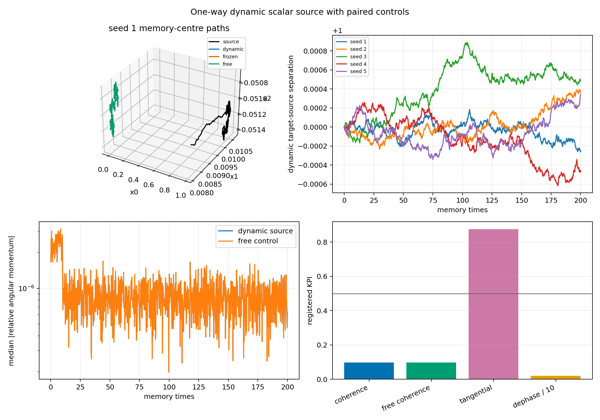

# One-Way Dynamic Scalar-Source Pilot

Date: 2026-07-20T09:41:07.185041+00:00.

## Question

Does an autonomously moving scalar-memory source produce a relational
translation or coherent orbital mode in a second knot beyond frozen-source
and no-cross controls?

## Time scales and source eligibility

- alpha=0.01: one code memory time is alpha^-1=100.000 updates; the exact e-folding time is 99.499 updates.
- The 20,000-update continuation spans 200.0 code memory times.
- The checkpoint is at N=100,000,000, or 1,000,000 code memory times.
- Checkpoint age alone is not a stationarity proof. Source radius and the
  rotation-invariant normalized shape spectrum are therefore tested during
  a 50.0-memory-time pre-launch window.

## Design

- One mature d=3 checkpoint is cloned into target and source.
- The source evolves under self-memory and independent future noise.
- External source launch: 0.1 sigma_rep over 10 memory times, after 50 memory times.
- The launch is an imposed probe, not emergent source propulsion.
- The source does not read the target.
- Dynamic-source, frozen-source, free, and eta=0 target paths share target noise.
- cross_eta is calibrated once to 0.03 target radii per memory time initially.
- Continuation seeds sample future noise, not independent formation basins.

## Registered gate

- Exact cross=0 identity: True (max error 0.000e+00).
- Stationary source shape before launch: True (median radius drift 9.951e-03; shape-spectrum drift 6.319e-03).
- Dynamic-versus-frozen source readout above 0.1 target radius: False.
- Launch-specific source displacement: 10.944 knot radii.
- Launch-specific target readout above 0.1 target radius: False (2.332e-04 radii).
- Source shape bounded/coherent versus paired unlaunched path: False (median max radius factor 1.590; maximum q95 spectral distance 0.273; limit 0.250).
- Target shape bounded/coherent versus its paired control: True.
- Median dynamic angular coherence: 0.097 (free 0.097).
- Median tangential fraction: 0.877.
- Median dephasing time: 0.200 memory times.
- Relational phase candidate: False.

## Seed rows

| continuation seed | source stationary | source displacement / R | launch source / R | launch target / R | source max radius factor | source spectrum median | source spectrum q95 |
|---:|:---:|---:|---:|---:|---:|---:|---:|
| 1 | True | 9.939 | 10.944 | 2.332e-04 | 1.569 | 8.882e-16 | 0.254 |
| 2 | True | 8.673 | 10.944 | 2.332e-04 | 1.590 | 1.527e-15 | 0.243 |
| 3 | True | 11.520 | 10.944 | 2.332e-04 | 1.612 | 3.331e-16 | 0.215 |
| 4 | True | 7.809 | 10.944 | 2.332e-04 | 1.593 | 6.661e-16 | 0.273 |
| 5 | True | 8.954 | 10.944 | 2.332e-04 | 1.548 | 1.255e-14 | 0.252 |

## Interpretation limits

- Shape-bounded/coherent permits rotation and bounded breathing. It does
  not require rigid or pointwise shape preservation.
- The v0.6 stationarity thresholds are preregistered pilot tolerances, not
  universal physical constants; negative controls must still calibrate them.
- This is an instantaneous unsigned scalar cross-channel.
- A moving-source response is not finite-speed propagation.
- Continuation seeds from one checkpoint are not independent knot types.
- Nonzero angular momentum amplitude without orientation coherence and
  control separation is stochastic bending, not spin or orbit.
- No charge, photon, synchronization, or Standard-Model claim follows.

## Reproduction

    python experiments/current/memory/synchronization/one_way_dynamic_source_pilot.py

Git revision: ff759b51cc1da4cd000611d0ba59e7326609162a.
Git status at generation: clean.
