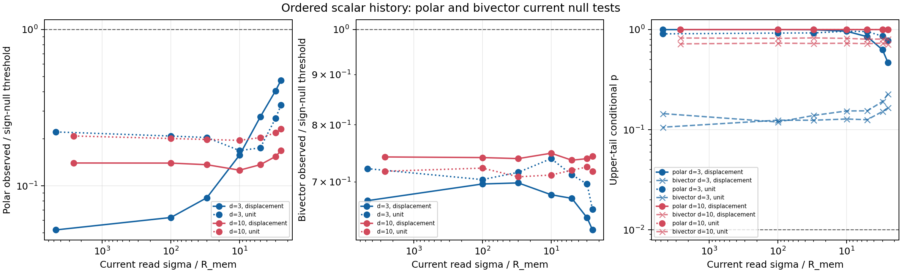

# Oriented history-current audit

Date: 2026-07-21T23:18:50+00:00

## Question and null

Do the ordered points of an existing scalar N=100M checkpoint already
encode a coherent vector current? The displacement current uses adjacent
retained-point differences; unit current is a sensitivity analysis.
An antisymmetric position-current bivector tests circulation separately,
so a closed ring is not rejected merely for zero polar net current.
The conditional null independently flips every current sign while keeping
positions, magnitudes, weights, kernel, and checkpoint fixed.

This is a derived-observable audit, not a vector-memory interaction,
oscillator, polarization, spin, photon, or particle test.

## Decision

Gate status: **fail**.

Selected next mechanism: **independent_oriented_memory_state**.

The primary gate uses displacement current at sigma/R=2.5. Polar and
bivector channels are evaluated separately; either must exceed sign-null
q=0.99 with direction cosine at least
0.90 against sigma/R=5
in every audited embedding to select a derived channel.

## Primary polar gate

| d | coherence | null q | observed/null | p_upper | direction cosine | pass |
| ---: | ---: | ---: | ---: | ---: | ---: | --- |
| 3 | 0.0748 | 0.1580 | 0.4736 | 0.4693 | 0.9969 | fail |
| 10 | 0.0185 | 0.1105 | 0.1678 | 1.0000 | 0.9103 | fail |

## Primary bivector-circulation gate

| d | coherence | null q | observed/null | p_upper | direction cosine | pass |
| ---: | ---: | ---: | ---: | ---: | ---: | --- |
| 3 | 0.1203 | 0.1923 | 0.6256 | 0.2274 | 0.9987 | fail |
| 10 | 0.0715 | 0.0962 | 0.7433 | 0.7141 | 0.9966 | fail |

## Resolution ladder

| d | mode | self | sigma/R | polar coh | polar/null | polar p | bivector coh | bivector/null | bivector p |
| ---: | --- | --- | ---: | ---: | ---: | ---: | ---: | ---: | ---: |
| 3 | displacement | yes | 4.725e+03 | 0.0078 | 0.0522 | 0.9980 | 0.1228 | 0.6699 | 0.1449 |
| 3 | displacement | no | 100.0000 | 0.0090 | 0.0627 | 0.9985 | 0.1228 | 0.6966 | 0.1194 |
| 3 | displacement | no | 30.0000 | 0.0125 | 0.0838 | 0.9955 | 0.1228 | 0.6984 | 0.1389 |
| 3 | displacement | no | 10.0000 | 0.0238 | 0.1574 | 0.9620 | 0.1227 | 0.6793 | 0.1539 |
| 3 | displacement | no | 5.0000 | 0.0414 | 0.2760 | 0.8486 | 0.1222 | 0.6736 | 0.1544 |
| 3 | displacement | no | 3.0000 | 0.0641 | 0.4053 | 0.6287 | 0.1211 | 0.6437 | 0.1909 |
| 3 | displacement | no | 2.5000 | 0.0748 | 0.4736 | 0.4693 | 0.1203 | 0.6256 | 0.2274 |
| 3 | unit | yes | 4.725e+03 | 0.0302 | 0.2212 | 0.9055 | 0.1186 | 0.7221 | 0.1059 |
| 3 | unit | no | 100.0000 | 0.0292 | 0.2082 | 0.9225 | 0.1186 | 0.7038 | 0.1244 |
| 3 | unit | no | 30.0000 | 0.0270 | 0.2037 | 0.9250 | 0.1185 | 0.7159 | 0.1244 |
| 3 | unit | no | 10.0000 | 0.0228 | 0.1681 | 0.9620 | 0.1184 | 0.7392 | 0.1279 |
| 3 | unit | no | 5.0000 | 0.0247 | 0.1749 | 0.9550 | 0.1180 | 0.7118 | 0.1259 |
| 3 | unit | no | 3.0000 | 0.0376 | 0.2701 | 0.8596 | 0.1172 | 0.6965 | 0.1519 |
| 3 | unit | no | 2.5000 | 0.0454 | 0.3281 | 0.7771 | 0.1167 | 0.6563 | 0.1654 |
| 10 | displacement | yes | 2.608e+03 | 0.0155 | 0.1399 | 1.0000 | 0.0695 | 0.7421 | 0.7196 |
| 10 | displacement | no | 100.0000 | 0.0153 | 0.1398 | 1.0000 | 0.0695 | 0.7410 | 0.7311 |
| 10 | displacement | no | 30.0000 | 0.0150 | 0.1365 | 1.0000 | 0.0696 | 0.7393 | 0.7261 |
| 10 | displacement | no | 10.0000 | 0.0145 | 0.1259 | 1.0000 | 0.0699 | 0.7486 | 0.7301 |
| 10 | displacement | no | 5.0000 | 0.0148 | 0.1365 | 1.0000 | 0.0704 | 0.7365 | 0.7226 |
| 10 | displacement | no | 3.0000 | 0.0170 | 0.1539 | 1.0000 | 0.0711 | 0.7392 | 0.7321 |
| 10 | displacement | no | 2.5000 | 0.0185 | 0.1678 | 1.0000 | 0.0715 | 0.7433 | 0.7141 |
| 10 | unit | yes | 2.608e+03 | 0.0220 | 0.2084 | 1.0000 | 0.0656 | 0.7177 | 0.8231 |
| 10 | unit | no | 100.0000 | 0.0220 | 0.2008 | 1.0000 | 0.0657 | 0.7230 | 0.8166 |
| 10 | unit | no | 30.0000 | 0.0218 | 0.1979 | 0.9995 | 0.0658 | 0.7084 | 0.8256 |
| 10 | unit | no | 10.0000 | 0.0216 | 0.1954 | 1.0000 | 0.0661 | 0.7114 | 0.8166 |
| 10 | unit | no | 5.0000 | 0.0221 | 0.2035 | 1.0000 | 0.0667 | 0.7195 | 0.8011 |
| 10 | unit | no | 3.0000 | 0.0239 | 0.2181 | 1.0000 | 0.0675 | 0.7250 | 0.8041 |
| 10 | unit | no | 2.5000 | 0.0252 | 0.2308 | 0.9995 | 0.0680 | 0.7172 | 0.8011 |

## Guardrails and next gate

The sign randomizations are conditional replicates, not independent
formation states. One checkpoint per embedding makes this pipeline
evidence. Joint polar and bivector failure means the retained scalar
history cannot simply be relabelled as a coherent oriented source under
these observables; it does
not prove that an independently evolving vector state is impossible.

An independent vector-state gate must use at least six formations,
common future noise, channel-off and sign-randomized deposits, a
relational angular/transverse primary observable, source shape bounds,
and a fixed stop rule. Complex AR eigenvalues are secondary only.

## Figure

## Reproducibility

- Analysis revision: 6a67cd017c21583ba1cc331f4629877a3b30ec61
- Summary: reports/response/oriented_history_current_audit_2026-07-21.json
- Command: python experiments/current/memory/synchronization/oriented_history_current_audit.py
