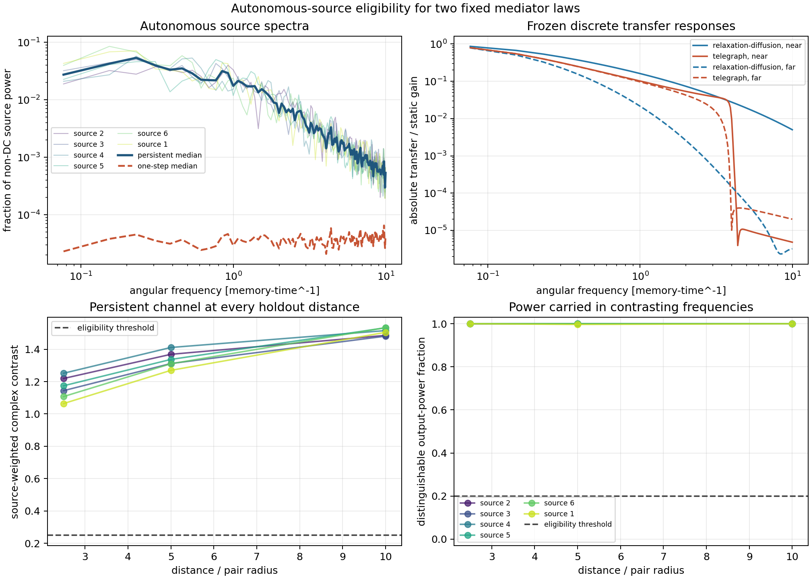

# Autonomous Oriented-Source Mediator Identifiability

Generated: `2026-07-28T18:30:50.594526+00:00`.

## Question

Do the six already frozen scalar knots, evolved autonomously with the previously introduced persistent orientation channel, carry stable non-DC power where the two fixed local mediator rules make different complex transfer predictions?

This is an eligibility audit. It does not fit either mediator to the source spectrum and cannot select a physical field law.

## Preregistered design

- source burn-in: `20.0000` memory times;
- `2` non-overlapping segments of `8192` updates each;
- persistent carrier orientation is the inferential source; normalized one-step displacement is retained only as a diagnostic comparator;
- exact finite-grid impulse responses are evaluated at all 18 inherited source-target distances;
- each model and distance is independently normalized to unit finite-horizon static gain. No coupling amplitude is calibrated here;
- a frequency is contrasting when its relative complex transfer separation is at least `0.2500`;
- pair pass requires all three distances and every source/segment gate; overall pass requires `5` of `6` independent sources.

## Decision

Status: **source_eligible_mechanism_still_underdetermined** (6/6 source pairs).

The autonomous persistent source carries stable power in frequency bands where the two fixed mediator laws differ. A dynamic holdout prediction can now be discriminating, but this audit does not select which inserted law is physical. Comparable one-step contrast means the pass does not specifically support persistent vector memory.

Across the inherited distances, persistent/one-step weighted-transfer contrast spans `0.9512` to `1.0083` (median `0.9913`). This comparator is diagnostic and was not used as a pass gate.

## Source results

| source | orientation RMS | radius max change | shape-spectrum drift | min contrast | min distinguishable power | min transmitted power | max segment drift | pass |
| ---: | ---: | ---: | ---: | ---: | ---: | ---: | ---: | --- |
| 2 | 0.0282 | 0.1536 | 0.1261 | 1.2191 | 0.9996 | 0.0322 | 0.1158 | pass |
| 3 | 0.0307 | 0.1832 | 0.1184 | 1.1438 | 0.9999 | 0.0469 | 0.1454 | pass |
| 4 | 0.0287 | 0.1725 | 0.1589 | 1.2515 | 0.9998 | 0.0371 | 0.1016 | pass |
| 5 | 0.0290 | 0.1380 | 0.1204 | 1.1741 | 1.0000 | 0.0388 | 0.0579 | pass |
| 6 | 0.0292 | 0.1400 | 0.1399 | 1.1074 | 0.9999 | 0.0664 | 0.1568 | pass |
| 1 | 0.0294 | 0.2073 | 0.1604 | 1.0641 | 0.9969 | 0.0630 | 0.0489 | pass |

## Distance-resolved contrast

| source | distance/R_pair | persistent contrast | persistent distinguishable | one-step contrast | one-step distinguishable |
| ---: | ---: | ---: | ---: | ---: | ---: |
| 2 | 2.5000 | 1.2191 | 0.9996 | 1.2624 | 0.9973 |
| 2 | 5.0000 | 1.3686 | 1.0000 | 1.3722 | 1.0000 |
| 2 | 10.0000 | 1.4858 | 1.0000 | 1.4758 | 1.0000 |
| 3 | 2.5000 | 1.1438 | 0.9999 | 1.2026 | 0.9992 |
| 3 | 5.0000 | 1.3116 | 1.0000 | 1.3333 | 1.0000 |
| 3 | 10.0000 | 1.4808 | 1.0000 | 1.4851 | 1.0000 |
| 4 | 2.5000 | 1.2515 | 0.9998 | 1.2904 | 0.9988 |
| 4 | 5.0000 | 1.4109 | 1.0000 | 1.4266 | 1.0000 |
| 4 | 10.0000 | 1.5153 | 1.0000 | 1.5113 | 1.0000 |
| 5 | 2.5000 | 1.1741 | 1.0000 | 1.2273 | 0.9996 |
| 5 | 5.0000 | 1.3370 | 1.0000 | 1.3468 | 1.0000 |
| 5 | 10.0000 | 1.5328 | 1.0000 | 1.5327 | 1.0000 |
| 6 | 2.5000 | 1.1074 | 0.9999 | 1.1493 | 0.9994 |
| 6 | 5.0000 | 1.3101 | 1.0000 | 1.3236 | 1.0000 |
| 6 | 10.0000 | 1.5334 | 1.0000 | 1.5286 | 1.0000 |
| 1 | 2.5000 | 1.0641 | 1.0000 | 1.1071 | 1.0000 |
| 1 | 5.0000 | 1.2695 | 0.9969 | 1.2738 | 0.9953 |
| 1 | 10.0000 | 1.5045 | 1.0000 | 1.4921 | 1.0000 |

## Interpretation boundary

A pass means only that the autonomous source is spectrally capable of exposing different predictions from the two already inserted mediator laws. A fail means that a further constructive source-target run cannot distinguish them under this source channel and should be stopped rather than rescued by parameter tuning.

The persistent orientation is itself an added low-pass state; it is not derived from scalar memory. The one-step comparator is therefore diagnostic, not a null that can validate the oriented channel. No reciprocity, conservation law, photon, spin, charge, particle, QFT, Lorentz, or finite-signal-speed claim follows.

## Three-dimensional selection

Fields do not select three dimensions merely by being introduced: both tested laws can be written in any supplied dimension, while this audit uses the same one-dimensional relational transport axis as the architecture gate. A later selection test must freeze one law and one absolute dimensionless parameter set across ambient dimensions, then show that the external response or slow-mode rank converges to three and that extra directions are dynamically suppressed. A 3D field grid would assume that result.

## Reproducibility

- mediator summary: `reports/response/local_oriented_mediator_gate_2026-07-28.json`
- source reference: `reports/response/oriented_vector_fixed_pair_distance_gate_2026-07-26.json`
- analysis revision: `3619401be19337c46655f013d7c75ebd2d31ea0a`
- worktree at start: `clean`
- command: `python experiments/current/memory/synchronization/oriented_source_mediator_identifiability.py`
