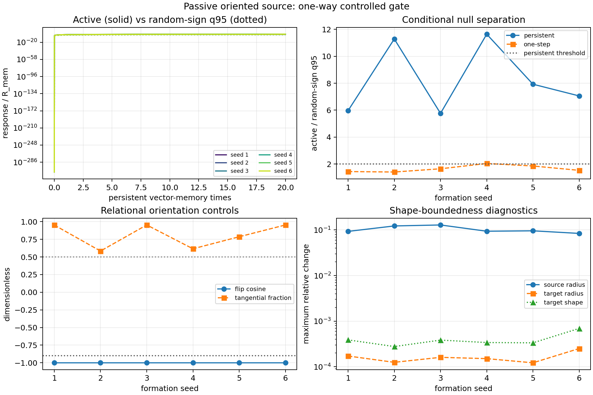

# Oriented vector one-way gate

Date: 2026-07-25T22:13:28+00:00

## Question and model increment

Does one additional passively generated vector-memory fibre produce a
reproducible transverse one-way response beyond sign-randomized deposits
while source and target remain shape-bounded? The added orientation obeys

```text
u[n+1] = (1-kappa) u[n] + kappa normalize(x[n+1]-x[n])
p[n+1] = (1-lambda_v) p[n] + lambda_v M_v u[n+1] G_v
x_T[n+1] = F_scalar(x_T[n], rho_T[n], xi_T[n]) + eta_v p[n](x_T[n])
```

with `kappa=lambda_v=alpha` in the primary arm. The source remains
autonomous and scalar; the target reads `p` instantaneously. This is not
a retardation, propagation-speed, phase, spin, photon, or particle test.

## Preregistered controls and stop rule

- six independent d=3 scalar formations at N=3,000,000;
- stop after 20 persistent memory times;
- 16 depositwise random-sign paths and q=0.95;
- exact channel-off path, global sign flip, and lambda_v=kappa=1 one-step control;
- common target/source future noise within each seed;
- coupling calibrated before continuation to 0.03 R_mem per persistent memory time
  from the initial field by the same predefined statewise normalization.

A seed passes only if response, random-sign separation, persistent-memory
gain, sign reversal, transverse fraction, and both shape bounds pass.
Numerical gates: active/R >= 0.0010; active/random-q95 >= 2.0000; persistent/one-step separation >= 1.2500; flip cosine <= -0.9000; tangential fraction >= 0.5000.
Shape bounds: target radius <= 0.1000; target tensor <= 0.1000; source radius <= 0.5000; source spectrum <= 0.2500.
Overall pass requires at least 5 of 6 seeds.

## Decision

Gate status: **pass** (6/6 seeds).

Selected next step: **fixed_coupling_independent_pair_distance_validation**.

## Seed results

| seed | active/R | random q95/R | active/q95 | one-step/q95 | memory gain | flip cos | tangent frac | target radius | target shape | source radius | source spectrum | pass |
| ---: | ---: | ---: | ---: | ---: | ---: | ---: | ---: | ---: | ---: | ---: | ---: | --- |
| 1 | 0.0040 | 6.743e-04 | 5.9629 | 1.4364 | 4.1513 | -1.0000 | 0.9516 | 1.723e-04 | 3.889e-04 | 0.0928 | 0.1229 | pass |
| 2 | 0.0064 | 5.689e-04 | 11.2868 | 1.4028 | 8.0457 | -1.0000 | 0.5839 | 1.253e-04 | 2.779e-04 | 0.1222 | 0.1318 | pass |
| 3 | 0.0041 | 7.163e-04 | 5.7601 | 1.6437 | 3.5044 | -1.0000 | 0.9531 | 1.612e-04 | 3.846e-04 | 0.1284 | 0.0889 | pass |
| 4 | 0.0075 | 6.439e-04 | 11.6434 | 2.0369 | 5.7163 | -1.0000 | 0.6157 | 1.510e-04 | 3.400e-04 | 0.0936 | 0.1214 | pass |
| 5 | 0.0053 | 6.714e-04 | 7.9264 | 1.8511 | 4.2819 | -1.0000 | 0.7861 | 1.222e-04 | 3.351e-04 | 0.0955 | 0.1147 | pass |
| 6 | 0.0076 | 0.0011 | 7.0555 | 1.5270 | 4.6204 | -1.0000 | 0.9531 | 2.513e-04 | 6.932e-04 | 0.0838 | 0.1035 | pass |

## Interpretation boundary

This pass establishes only that the deliberately introduced
persistent orientation state carries a controlled relational signal
more coherently than its randomized and one-step controls.
Source and target are clones within each formation seed, and eta_v
is normalized statewise by a predefined formula. Persistence and the
instantaneous direct vector readout are model inputs, not discoveries.
The next gate therefore fixes one global coupling, pairs different
formation seeds, and tests a distance ladder before any retarded field.
No wave, spin, photon, charge, particle, or propagation claim follows.

## Figure



## Reproducibility

- Formation config: `{"alpha": 0.01, "amplitude_att": 35.0, "amplitude_rep": 1.0, "burn_in": 0, "deposition_kernel": "delta", "deposition_sigma": 0.0, "dim": 3, "epsilon": 0.0001, "eta": 0.15, "max_memory": 800, "memory_factor": 6.0, "memory_mass": 1.0, "sample_every": 1000, "sigma_att": 3.0, "sigma_rep": 1.0, "steps": 3000000}`
Input cases:
- Input seed 1: `data/processed/long_run_metastability/raw_memory_snapshot_retest_Aatt35_N3M_d3_seed1-5_2026-07-16/case_baseline_seed1_steps3000000.json`, SHA-256 `10c8650d40d1fff01c2bc7aa6d4661f271acff35fe9395dfc101e6448d746614`
- Input seed 2: `data/processed/long_run_metastability/raw_memory_snapshot_retest_Aatt35_N3M_d3_seed1-5_2026-07-16/case_baseline_seed2_steps3000000.json`, SHA-256 `41e5def5bee92feebd204ac89ab2566ac2960af0d6933f09129251f12e361188`
- Input seed 3: `data/processed/long_run_metastability/raw_memory_snapshot_retest_Aatt35_N3M_d3_seed1-5_2026-07-16/case_baseline_seed3_steps3000000.json`, SHA-256 `882721c56e67ed90e3c937d54223c1bdb6e4dcb970877edf3a267e9ab9919816`
- Input seed 4: `data/processed/long_run_metastability/raw_memory_snapshot_retest_Aatt35_N3M_d3_seed1-5_2026-07-16/case_baseline_seed4_steps3000000.json`, SHA-256 `7e7b0949b45e14413ee6901fe5e3a9a657e4a30e2b1401679d3f7e1e08b9bc6e`
- Input seed 5: `data/processed/long_run_metastability/raw_memory_snapshot_retest_Aatt35_N3M_d3_seed1-5_2026-07-16/case_baseline_seed5_steps3000000.json`, SHA-256 `a3f41aebf2673c3cbffc38d163f0e448d505565605a730f41bddf269382730f1`
- Input seed 6: `data/processed/long_run_metastability/raw_memory_snapshot_retest_Aatt35_N3M_d3_seed6_2026-07-22/case_baseline_seed6_steps3000000.json`, SHA-256 `ecdec2a7324bba2b2047c224b15e6ec80414b29503c927b9a94f7da73b408217`
- Analysis revision: e04e11c541411e8f434102470c01bc9453b79c7c
- Worktree at start: `clean`
- Summary: reports/response/oriented_vector_one_way_gate_2026-07-25.json
- Command: python experiments/current/memory/synchronization/oriented_vector_one_way_gate.py
