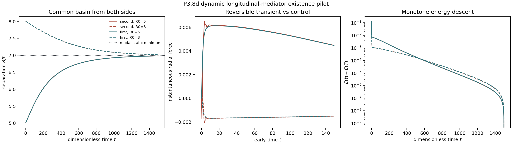

# P3.8d dynamic two-knot mediator gate

Date: 2026-08-12. Decision: **`p38d-conditional-dynamic-existence-pass`**.

## Model boundary

This experiment advances the proposed longitudinal mediator `(m,p)` and two
symmetric point sources. It does not replace or silently modify the canonical
`z=(x,rho)` process. The source separation `R` is overdamped; no mechanical
mass is inserted for the knot centres.

For modal source loading \(B(R)\) and positive stiffness \(A\), the candidate is

\[
\dot{\mathbf m}=\mathbf p,
\qquad
\dot{\mathbf p}=-\Gamma\mathbf p-A\mathbf m+B(R),
\qquad
\dot R=\nu\,\partial_R B(R)\cdot\mathbf m.
\]

with energy

\[
E=\frac12\|\mathbf p\|^2+\frac12\mathbf m^T A\mathbf m
-B(R)\cdot\mathbf m,
\qquad
\dot E=-\Gamma\|\mathbf p\|^2-\frac{\dot R^2}\nu\leq0.
\]

The same source functional supplies field writing and source readout. The
separation substep uses a scalar discrete gradient, so source work closes
without replacing `B(R)` by a local force approximation. Fixed-source field
substeps are analytic. The first-order control uses
`Gamma m_dot=-A m+B(R)` and therefore has exactly the same equilibrium
susceptibility but no conjugate velocity.

## Fixed scope

- analytic witness: `(delta,mu,r_gamma)=(-1.9,0.3,1)`;
- relative source mobility: `nu=1`, fixed as an existence witness, not inferred;
- modal quadrature: `64 x 64`, `k_max=16`;
- initial separations: `R/ell=5` and `8`;
- duration `T=1500`, step `dt=0.5`;
- no gain, coefficient, noise, kernel or mobility sweep.

## Registered gates

| Gate | Result |
|---|---|
| `static_modal_quadrature_preserves_registered_force_signs` | pass |
| `static_modal_barrier_and_minimum_match_green_inversion` | pass |
| `homogeneous_damping_matches_independent_time_quadrature` | pass |
| `cross_off_is_exact` | pass |
| `first_and_second_order_share_static_susceptibility` | pass |
| `second_order_selected_mode_overshoots` | pass |
| `first_order_selected_mode_is_monotone` | pass |
| `split_scheme_has_second_order_step_convergence` | pass |
| `dynamic_energy_balance_closes` | pass |
| `second_order_pilots_enter_common_static_basin` | pass |
| `pilot_final_separation_is_time_step_stable` | pass |
| `static_basin_is_uv_stable` | pass |
| `second_order_pilot_differs_from_first_order_control` | pass |
| `second_order_quench_has_nonzero_force_reversal` | pass |
| `equilibrium_initialized_controls_enter_same_basin` | pass |
| `force_reversal_is_quench_dependent` | pass |

Static modal inversion gives barrier `3.920212126` and basin
minimum `6.994348882`. Its maximum absolute force error at
the registered nonstationary radii is `9.864e-05`.
The independent damping quadrature residual is
`1.388e-17`.

Time-step errors against `dt=0.03125` over
`T=50.0` are
`2.636e-03, 7.273e-04, 2.082e-04`
for `dt=(0.25,0.125,0.0625)`, with observed orders
`1.858, 1.805`.

## Dynamic result

| order | initial R/ell | final R/ell | force sign changes | max balance residual |
|---|---:|---:|---:|---:|
| second | 5 | 6.979220409 | 1 | 1.339e-15 |
| second | 8 | 7.015975934 | 2 | 5.159e-16 |
| first | 5 | 6.978953961 | 0 | 1.028e-15 |
| first | 8 | 7.016379788 | 0 | 4.909e-16 |

Both second-order starts enter the same static basin while total energy remains
monotone. The reversible and first-order trajectories are measurably distinct;
both reversible arms show one or more nonzero-force sign changes during the
point-source quench, while the matched first-order arms are sign-monotone.
When both fields instead start at their static equilibrium for the initial
separation, all arms retain the common basin but the force reversals disappear.
The ringing is therefore a quench-dependent reversible transient, not an
initialization-independent pair property. The
matched first-order arm approaches the same basin and
equilibrium response without a selected-mode overshoot. At the selected mode,
the second-order linear step
response peaks at `1.007415307` and has period
`17.907628`; the first-order response is monotone.

Repeating the second-order endpoint with `dt=0.25` changes final separation by
less than `2e-3`. A separate `k_max=16..28` check keeps the static minimum
within `0.004 ell` of the exact Green result but shows slower convergence of
the earliest force extrema than of separation. Those UV-sensitive point-source
quench amplitudes are retained as diagnostics and are not interpreted as a
physical observable.

## Interpretation

P3.8d is a conditional **dynamic existence pass** for the proposed mediator:
one energy supplies reciprocal source/readout coupling, the discrete scheme
closes work and damping, the two registered time realizations are distinguishable
under a zero-field quench, and one fixed collinear pilot relaxes into the
quasistatic separated basin.

It is not emergence from the scalar knot equations. The mediator state,
constitutive coefficients, relative mobility and scale matching remain new
inputs. The pilot uses point sources because the mature checkpoint is
`2.12e-4 ell` wide; it neither evolves the complete knot shape nor deposits
canonical memory. Force reversal is a damped field transient, not an orbit,
spin or persistent coherent oscillation. The energy Lyapunov function in fact
excludes a non-decaying limit cycle in this autonomous damped reduction.
The first-order kinetic prefactor was matched to `Gamma` as one timing
convention; it is a useful registered control, not the entire first-order null
family.
Action/reaction is enforced by the symmetric single-separation reduction; it
is not an independent many-body momentum-conservation measurement.

Therefore the next scientific question is mechanism closure: can the
canonical trajectory/memory data identify or generate this mediator and its
dimensionless coefficients on holdout responses? A coefficient sweep would
only demonstrate tunability and remains blocked.

## Reproducibility

- script: `experiments/current/memory/synchronization/reciprocity/dynamic_two_knot_mediator_gate.py`;
- package: `src/emergenz_knoten/dynamic_gradient_mediator.py`;
- git revision before generated changes: `0214741ea00038e1896f477a219fc1353d66eca9`;
- generated: `2026-08-12T21:38:27.910405+00:00`.
