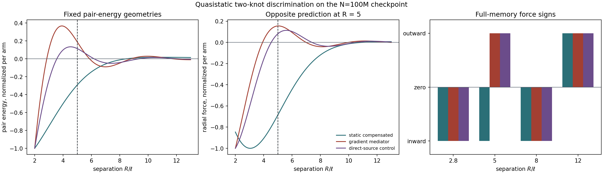

# Quasistatic Two-Knot Discrimination

Date: 2026-08-12. Decision: **`quasistatic-discrimination-pass-pointlike-full-memory`**.

## Fixed review scope

This is the first P3.8c stage after the rigorous P3.8a/b review. It uses the
checksum-validated `d=3`, seed-1 scalar checkpoint at `N=100,000,000`. Both
complete retained memory clouds are translated rigidly. No trajectory or
mediator state is advanced, no coupling gain is calibrated and no parameter is
swept.

The test compares three fixed source-source pair laws:

1. the existing exact-zero-integral static compensated Gaussian kernel;
2. the reviewed adjoint-gradient mediator susceptibility with
   `(delta,mu)=(-1.9,0.3)` and pair energy `U=-K_eff`;
3. the direct-source susceptibility as a nonzero-zero-mode architecture control.

The a priori model-derived common discriminator is `R/ell=5`: the static arm
predicts inward force and the gradient mediator predicts outward force. Raw
amplitudes between model families are not compared.

## Force signs

Positive means increasing separation (outward); negative means inward.

| R/ell | static compensated | gradient mediator | direct-source control |
|---:|---:|---:|---:|
| 2.8 | -6.929655e+00 | -2.174023e-02 | -2.392629e-02 |
| 5 | -4.783749e+00 | +6.487316e-03 | +2.773096e-03 |
| 8 | -8.298596e-01 | -1.697393e-03 | -9.564522e-04 |
| 12 | +3.929468e-02 | +3.714310e-04 | +3.565411e-04 |

At the fixed `R/ell=5`, the full-memory forces are
`-4.783749e+00` and
`+6.487316e-03`. Their
opposite signs make a future observed two-node response discriminating without
gain matching.

The primary reciprocal energy couples the two retained source densities. That
is a new cross-channel choice, not the canonical one-visible-point readout. A
separate reciprocal symmetrization of the canonical visible-to-foreign-memory
readout preserves the same discriminator signs; its relative force differences
from the source-density law are
`2.411e-03`
(static) and
`2.411e-03`
(gradient mediator). The common amplitude offset is explained to within
`1.048e-08` by the finite retained mass
`M_H=0.997594991`: the point limit scales as `M_H^2`
for memory-memory and as `M_H` for visible-memory coupling. Compactness
preserves the radial profiles and signs; it does not make the two cross-channel
definitions identical.

## Stationary radii

| model | root | point prediction | full-memory range over 3 orientations | full-memory type | max relative shift |
|---|---:|---:|---:|---|---:|
| static_compensated | 1 | 10.9130736 | 10.9130736..10.9130736 | unstable | 1.369e-09 |
| gradient_mediator | 1 | 3.91920037 | 3.91920038..3.91920038 | unstable | 2.668e-09 |
| gradient_mediator | 2 | 6.9909163 | 6.99091631..6.99091631 | stable | 1.449e-09 |
| direct_source_control | 1 | 4.52928733 | 4.52928734..4.52928735 | unstable | 2.739e-09 |
| direct_source_control | 2 | 7.40543899 | 7.405439..7.405439 | stable | 1.199e-09 |

The static compensated arm has only an unstable separation in the fixed
range. The gradient mediator has a full-memory unstable barrier followed by a
stable quasistatic pair-energy minimum. The direct-source control also has shells,
showing that shells alone do not establish neutrality; unlike the gradient
arm, its Fourier zero mode is nonzero.

## Final review gates

| gate | result |
|---|---|
| `checkpoint_schema_and_checksum_valid` | pass |
| `static_compensated_integral_zero` | pass |
| `gradient_mediator_zero_mode_zero` | pass |
| `direct_source_zero_mode_nonzero_control` | pass |
| `cross_off_energy_and_force_exactly_zero` | pass |
| `common_radius_force_sign_discriminates_for_all_orientations` | pass |
| `canonical_readout_symmetrization_preserves_discriminator_signs` | pass |
| `readout_amplitude_offset_matches_finite_tail_mass` | pass |
| `static_arm_has_one_full_memory_unstable_radius` | pass |
| `gradient_arm_has_full_memory_barrier_then_stable_minimum` | pass |
| `force_is_negative_pair_energy_gradient` | pass |
| `action_reaction_exact` | pass |
| `full_memory_root_residuals_resolved` | pass |
| `point_limit_converges_at_second_order` | pass |

Maximum force-versus-energy-gradient error:
`1.856e-10`. Maximum action/reaction
residual: `0.000e+00`. Maximum
full-memory root shift from the point prediction:
`2.739e-09`; maximum normalized root residual:
`6.482e-12`. Point-limit convergence order over
internally scaled copies of the same stored cloud:
`1.999975..2.000138`.

## Interpretation

This is a **mechanism-discriminability and implementation pass**, not a
mechanism-selection pass. The complete knot is so compact
(`R_mem=0.000211653` in units where `ell=1`) that its
finite-memory force differs from the point-source prediction only at the
expected quadratic multipole scale. The result therefore validates the
source-density convolution and proves that the two fixed architectures make
opposite predictions at one fixed, model-derived separation. It does not show
that the dynamic gradient mediator exists, equilibrates, or stabilizes a
moving two-knot state.

The comparison also imposes `ell=sigma_rep=1`; no observation identifies that
cross-family scale matching. It is therefore a conditional discriminator, not
evidence that either physical scale is selected.

A dynamic continuation now requires an explicit time discretization of the
new `(m,p)` field, one shared interaction energy, and source-work plus damping
balance. `reversible-off` becomes a useful control only there: in static
equilibrium a first-order relaxation and a reversible second-order field share
the same susceptibility. No dynamic gain, mobility or timestep is inferred by
this frozen test.

No claim about charge, spin, particles, quantum dynamics or selection of three
dimensions follows.

## Reproducibility

- checkpoint: `data/processed/reference_states/scalar_Aatt35_N100M_d3_d10_seed1_2026-07-16/scalar_Aatt35_d3_seed1_N100000000.npz`;
- script: `experiments/current/memory/synchronization/reciprocity/quasistatic_two_knot_discrimination.py`;
- packages: `src/emergenz_knoten/gradient_mediator.py`,
  `src/emergenz_knoten/quasistatic_pair.py`;
- git revision before generated changes: `bd31965aeec8aa9ef04a8b78d1eef5bb8e794c59`;
- generated: `2026-08-12T03:51:29.188038+00:00`.

This audit was not sealed in a separate immutable preregistration commit. The
physical arms, radii and `R/ell=5` discriminator were fixed before the final
checkpoint evaluation; numerical validation gates were corrected during code
review and are documented in the P3.8 review report.
