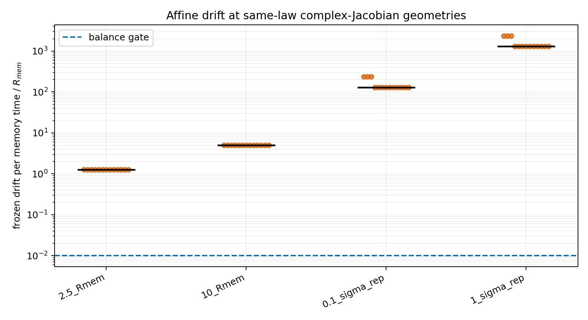

# Same-law affine-balance gate

Date: 2026-08-11T19:30:37+00:00.

**Decision: `affine-balance-negative`.**

This registered post-Jacobian gate tests the affine residual omitted by
a curvature-only mode classification.

## Results

| distance | fixed eta | frozen drift / R_mem per memory time min..median..max | balance pass |
|---|---:|---:|---:|
| `2.5_Rmem` | 0.0017349417 | 1.25..1.25..1.25 | 0/13 |
| `10_Rmem` | 0.0017349406 | 5..5..5 | 0/13 |
| `0.1_sigma_rep` | 0.0017323805 | 130.356..130.356..236.117 | 0/13 |
| `1_sigma_rep` | 0.0016265818 | 1300.34..1300.34..2355.34 | 0/13 |

Point-deposit positive force-zero radius: d=3: none, d=10: none.

For the compact point limit, self-confinement requires
`A_att/L_att^2 > A_rep/L_rep^2`, whereas a positive two-scale
force-zero radius requires the strict opposite inequality. The
same scalar two-Gaussian law cannot satisfy both conditions.

## Interpretation

The previously identified complex Jacobian windows are not stationary
normal modes under the unchanged same-law kernel. Their expansion
points carry a finite relative drift, and the point-deposit kernel has
no non-zero force-balance radius. A nonlinear low-g oscillation pilot
is therefore blocked.

This does not rule out transient curved response or a balance supplied
by a distinct charge/sign channel, screening, retardation, more nodes or
another dynamical field. Such a term would be a new mechanism and must
be specified before its parameters are estimated.

## Reproducibility

- Jacobian input: `reports/response/reciprocal/same_law_reciprocal_jacobian_audit_2026-08-11.json`;
- common-scale input: `reports/response/reciprocal/same_law_common_scale_followup_2026-08-11.json`;
- revision: `1861d015842830d1b554c8a86a17891b88a3074d`;
- worktree at execution: `M docs/reference/THEORETICAL_CONTEXT.md
 M docs/status/current_status.md
 M docs/status/project_priorities.md
 M reports/README.md
 M src/emergenz_knoten/__init__.py
 M src/emergenz_knoten/analytic.py
 M src/emergenz_knoten/kernels.py
 M tests/test_analytic.py
?? experiments/current/memory/synchronization/reciprocity/same_law_affine_balance_gate.py
?? experiments/current/memory/synchronization/reciprocity/same_law_common_scale_followup.py
?? experiments/current/memory/synchronization/reciprocity/same_law_reciprocal_jacobian_audit.py
?? figures/draft/response/same_law_affine_balance_gate_2026-08-11.png
?? figures/draft/response/same_law_common_scale_followup_2026-08-11.png
?? figures/draft/response/same_law_reciprocal_jacobian_audit_2026-08-11.png
?? reports/project/meta/preregistration/same_law_affine_balance_gate_2026-08-11.md
?? reports/project/meta/preregistration/same_law_common_scale_followup_2026-08-11.md
?? reports/project/meta/preregistration/same_law_reciprocal_jacobian_audit_2026-08-11.md
?? reports/response/reciprocal/same_law_affine_balance_gate_2026-08-11.json
?? reports/response/reciprocal/same_law_affine_balance_gate_2026-08-11.md
?? reports/response/reciprocal/same_law_common_scale_followup_2026-08-11.json
?? reports/response/reciprocal/same_law_common_scale_followup_2026-08-11.md
?? reports/response/reciprocal/same_law_reciprocal_jacobian_audit_2026-08-11.json
?? reports/response/reciprocal/same_law_reciprocal_jacobian_audit_2026-08-11.md
?? src/emergenz_knoten/reciprocal_parameter_closure.py
?? tests/test_reciprocal_parameter_closure.py`;
- JSON: `reports/response/reciprocal/same_law_affine_balance_gate_2026-08-11.json`.
