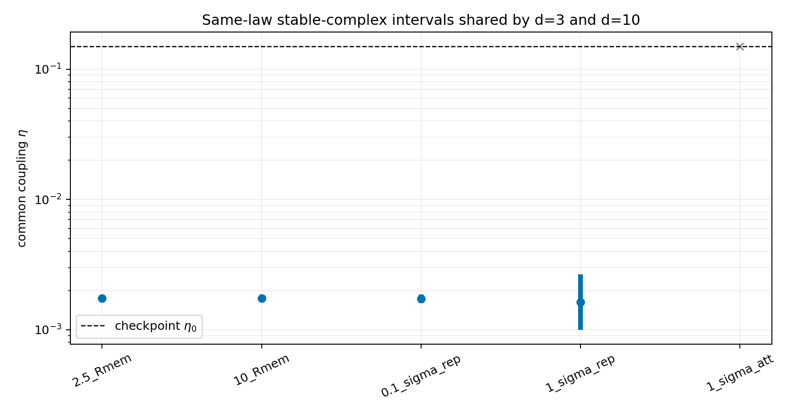

# Same-law common-scale follow-up

Date: 2026-08-11T19:30:34+00:00.

**Decision: `common-scale-eligible`.**

This is a registered post-audit follow-up to the inconclusive fixed-gain
Jacobian audit. Self and cross gains are scaled together; no separate
cross normalization and no trajectory-frequency fit are used.

## Shared intervals

| distance | all directional scale intervals | shared eta interval | fixed midpoint eta | full matrix pass |
|---|---:|---:|---:|---:|
| `2.5_Rmem` | 13/13 | 0.0017342528..0.0017356308 | 0.0017349417 | 13/13 |
| `10_Rmem` | 13/13 | 0.0017321494..0.0017377363 | 0.0017349406 | 13/13 |
| `0.1_sigma_rep` | 13/13 | 0.0016054995..0.0018692888 | 0.0017323805 | 13/13 |
| `1_sigma_rep` | 13/13 | 0.0009965458..0.0026549391 | 0.0016265818 | 13/13 |
| `1_sigma_att` | 0/13 | none | n/a | 0/13 |

## Result boundary

The shared full-matrix gate passes at `2.5_Rmem`, `10_Rmem`, `0.1_sigma_rep`, `1_sigma_rep`.
This reduces the local pilot choice to one common coupling and a
pre-existing normalized separation. It does not show that the
microscopic dynamics selects either quantity, nor that nonlinear
trajectories sustain an oscillation.

Only one mature formation seed is available in each of d=3 and d=10.
The result is a local structural eligibility test, not seed-robust
evidence, a persistent orbit, a quantum state or dimension selection.

## Reproducibility

- input audit: `reports/response/reciprocal/same_law_reciprocal_jacobian_audit_2026-08-11.json`;
- revision: `1861d015842830d1b554c8a86a17891b88a3074d`;
- worktree at execution: `M docs/reference/THEORETICAL_CONTEXT.md
 M docs/status/current_status.md
 M docs/status/project_priorities.md
 M reports/README.md
 M src/emergenz_knoten/__init__.py
 M src/emergenz_knoten/analytic.py
 M src/emergenz_knoten/kernels.py
 M tests/test_analytic.py
?? experiments/current/memory/synchronization/reciprocity/same_law_affine_balance_gate.py
?? experiments/current/memory/synchronization/reciprocity/same_law_common_scale_followup.py
?? experiments/current/memory/synchronization/reciprocity/same_law_reciprocal_jacobian_audit.py
?? figures/draft/response/same_law_affine_balance_gate_2026-08-11.png
?? figures/draft/response/same_law_common_scale_followup_2026-08-11.png
?? figures/draft/response/same_law_reciprocal_jacobian_audit_2026-08-11.png
?? reports/project/meta/preregistration/same_law_affine_balance_gate_2026-08-11.md
?? reports/project/meta/preregistration/same_law_common_scale_followup_2026-08-11.md
?? reports/project/meta/preregistration/same_law_reciprocal_jacobian_audit_2026-08-11.md
?? reports/response/reciprocal/same_law_affine_balance_gate_2026-08-11.json
?? reports/response/reciprocal/same_law_affine_balance_gate_2026-08-11.md
?? reports/response/reciprocal/same_law_common_scale_followup_2026-08-11.json
?? reports/response/reciprocal/same_law_common_scale_followup_2026-08-11.md
?? reports/response/reciprocal/same_law_reciprocal_jacobian_audit_2026-08-11.json
?? reports/response/reciprocal/same_law_reciprocal_jacobian_audit_2026-08-11.md
?? src/emergenz_knoten/reciprocal_parameter_closure.py
?? tests/test_reciprocal_parameter_closure.py`;
- JSON: `reports/response/reciprocal/same_law_common_scale_followup_2026-08-11.json`.
