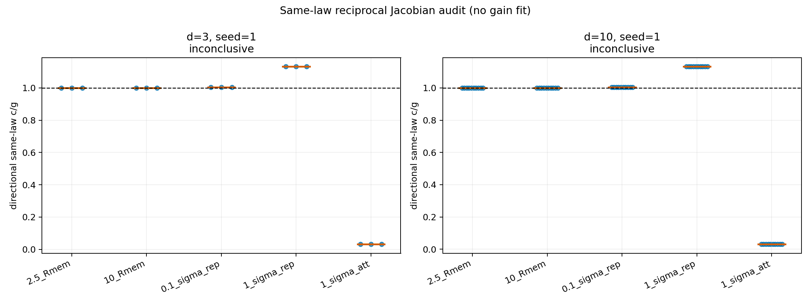

# Same-law reciprocal Jacobian audit

Date: 2026-08-11T19:30:31+00:00.

**Decision: `inconclusive`.**

This audit computes self and cross Hessians from complete stored memory states.
It does not fit a trajectory frequency or retune the cross gain.

## Model boundary

The reduced state is $Y_-=(x_-,\bar x_-^\rho)$. The matrices
$G=\eta\nabla^2\Phi_{self}$ and $C(R)=\eta\nabla^2\Phi_{cross}$
are evaluated under the same kernel and coupling. The full
$A_-(G,C,\lambda)$ spectrum is derived from them. None of $Y_-$,
$A_-$ or its poles is an additional microscopic parameter.

## Results

| d | seed | N | R_mem | eig(G) min..max | g threshold | max c/g | max eig(C-G) | complex rows | decision |
|---:|---:|---:|---:|---:|---:|---:|---:|---:|---|
| 3 | 1 | 100000000 | 0.000211653 | 0.432291..0.432291 | 0.00990099 | 1.13191886 | 0.0570274 | 0 | `inconclusive` |
| 10 | 1 | 100000000 | 0.000383373 | 0.432291..0.432291 | 0.00990099 | 1.131923 | 0.0570292 | 0 | `inconclusive` |

Directional values by preregistered distance:

| d | distance | c/g min..median..max | max eig(C-G) | stable complex |
|---:|---|---:|---:|---:|
| 3 | `2.5_Rmem` | 1.00000008..1.00000008..1.00000013 | 5.47317e-08 | 0/3 |
| 3 | `10_Rmem` | 1.00000131..1.00000132..1.0000015 | 6.47185e-07 | 0/3 |
| 3 | `0.1_sigma_rep` | 1.00292763..1.00292832..1.00293638 | 0.00126937 | 0/3 |
| 3 | `1_sigma_rep` | 1.13191719..1.13191732..1.13191886 | 0.0570274 | 0/3 |
| 3 | `1_sigma_att` | 0.0306767953..0.030761849..0.0307690829 | -0.0809938 | 0/3 |
| 10 | `2.5_Rmem` | 1.00000027..1.00000027..1.00000057 | 2.46716e-07 | 0/10 |
| 10 | `10_Rmem` | 1.00000433..1.00000434..1.00000553 | 2.39195e-06 | 0/10 |
| 10 | `0.1_sigma_rep` | 1.00292799..1.0029282..1.00295902 | 0.00127916 | 0/10 |
| 10 | `1_sigma_rep` | 1.1319172..1.13191724..1.131923 | 0.0570292 | 0/10 |
| 10 | `1_sigma_att` | 0.0304379369..0.0307630305..0.0307652896 | -0.0809945 | 0/10 |

## Interpretation boundary

A stable complex local pole would be a damped relative mode, not a
persistent orbit, quantum state, particle or dimension-selection result.
The available repository state coverage is one formation seed in each
of d=3 and d=10; this is a structural case study, not seed-robust evidence.

## Reproducibility

- revision: `1861d015842830d1b554c8a86a17891b88a3074d`;
- worktree at execution: `M docs/reference/THEORETICAL_CONTEXT.md
 M docs/status/current_status.md
 M docs/status/project_priorities.md
 M reports/README.md
 M src/emergenz_knoten/__init__.py
 M src/emergenz_knoten/analytic.py
 M src/emergenz_knoten/kernels.py
 M tests/test_analytic.py
?? experiments/current/memory/synchronization/reciprocity/same_law_affine_balance_gate.py
?? experiments/current/memory/synchronization/reciprocity/same_law_common_scale_followup.py
?? experiments/current/memory/synchronization/reciprocity/same_law_reciprocal_jacobian_audit.py
?? figures/draft/response/same_law_affine_balance_gate_2026-08-11.png
?? figures/draft/response/same_law_common_scale_followup_2026-08-11.png
?? figures/draft/response/same_law_reciprocal_jacobian_audit_2026-08-11.png
?? reports/project/meta/preregistration/same_law_affine_balance_gate_2026-08-11.md
?? reports/project/meta/preregistration/same_law_common_scale_followup_2026-08-11.md
?? reports/project/meta/preregistration/same_law_reciprocal_jacobian_audit_2026-08-11.md
?? reports/response/reciprocal/same_law_affine_balance_gate_2026-08-11.json
?? reports/response/reciprocal/same_law_affine_balance_gate_2026-08-11.md
?? reports/response/reciprocal/same_law_common_scale_followup_2026-08-11.json
?? reports/response/reciprocal/same_law_common_scale_followup_2026-08-11.md
?? reports/response/reciprocal/same_law_reciprocal_jacobian_audit_2026-08-11.json
?? reports/response/reciprocal/same_law_reciprocal_jacobian_audit_2026-08-11.md
?? src/emergenz_knoten/reciprocal_parameter_closure.py
?? tests/test_reciprocal_parameter_closure.py`;
- same-law means identical self/cross kernel, deposition and eta;
- JSON: `reports/response/reciprocal/same_law_reciprocal_jacobian_audit_2026-08-11.json`.
