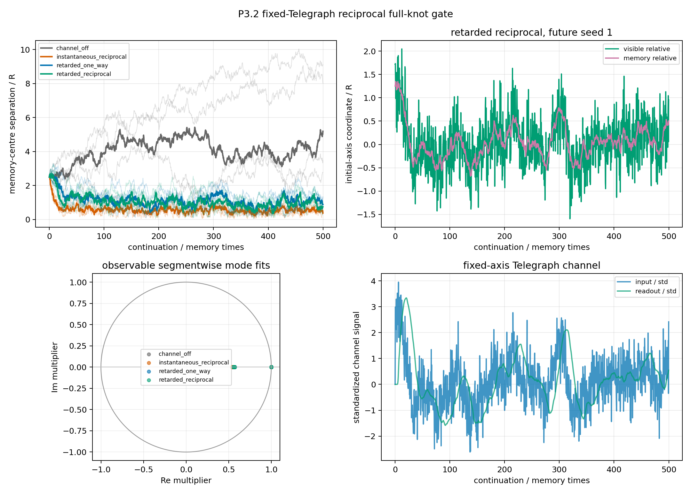

# P3.2 retarded reciprocal full-knot gate

Date: 2026-08-04T14:06:37+00:00.

## Question

Does the already fixed scalar reciprocal readout acquire a stable,
control-separated complex observable relative mode when it is passed
through one preregistered local Telegraph channel?

## Fixed mechanism

- mature d=3 checkpoint at N=100,000,000, formation seed 1;
- lambda=0.01, direct P3.1 gain c=0.02, cross_eta=0.006939767;
- initial pair distance 2.5 R; fixed channel correlation length 5 R and relaxation time 10 memory times;
- grid spacing 0.25 R, Courant number 0.02, nominal r/v time 5 memory times;
- the finite grid axis and target readout position remain fixed during each continuation; no moving-grid phase is introduced;
- the mediator input is still the target-specific instantaneous cross-gradient; only its transport/filter state is local, so this is not a fully local source-field theory;
- the discrete DC readout is solved exactly and normalized to unity (raw gain 28649.14); no knot-response calibration or cross-gain retuning is performed;
- 5 condition-common, node-specific future-noise seeds, 50,000 updates = 500.0 memory times, first 100.0 excluded.

The arms are channel-off, the exact instantaneous reciprocal P3.1 control,
retarded one-way, and retarded reciprocal. Unit tests require the direct
control to be bitwise identical to the existing P3.1 implementation.

## Preregistered gate

The primary observable remains the coordinate-fixed-effects 2 x 2 `(x_-, m_-)` map. Complex
internal Telegraph poles are inserted by construction and cannot establish
a knot mode. A seed needs stable non-real fits in at least
3/4 segments, frequency at least 0.05 per memory time, phase coherence at least 0.5, and registered fit/identity/shape bounds. The candidate needs 4/5 reciprocal seeds and at most 1 in every control.

The direct local prediction remains real: discriminant 0.208318, multipliers [{'real': 0.9991252883200965, 'imag': 0.0}, {'real': 0.5427064606658762, 'imag': 0.0}].

## Result

Classification: **retarded channel operational; complex-mode null**.

- candidate seeds off / direct / retarded one-way / retarded reciprocal: 0 / 0 / 0 / 0;
- retarded reciprocal mediator detected: 5/5;
- retarded reciprocal response detected: 5/5;
- retarded reciprocal shape bounded/coherent: 5/5;
- control-separated complex candidate: False.
- raw non-real segment fits: 0/80;
- final distance/R, direct: 0.3145..0.8797;
- final distance/R, retarded reciprocal: 0.5841..1.213;
  the delay weakens or postpones binding but does not create rotation in the registered AR(1) readout.

## Seed rows

| future seed | off | direct | retarded one-way | retarded reciprocal | mediator RMS | final distance/R | candidate |
| ---: | ---: | ---: | ---: | ---: | ---: | ---: | :---: |
| 1 | 0 | 0 | 0 | 0 | 2.724e-04 | 1.213 | False |
| 2 | 0 | 0 | 0 | 0 | 2.900e-04 | 0.5841 | False |
| 3 | 0 | 0 | 0 | 0 | 2.855e-04 | 0.9337 | False |
| 4 | 0 | 0 | 0 | 0 | 2.917e-04 | 0.603 | False |
| 5 | 0 | 0 | 0 | 0 | 2.469e-04 | 0.8611 | False |

## Interpretation boundary

This is a mechanism test of one inserted retarded channel, not discovery
of a field law. Its input remains a target-specific cross-gradient from
the current source memory. Only the transport/filter update is local; a
source-local emission field has not been derived.

The fixed one-dimensional relation axis carries vectors in a supplied
d=3 ambient state. Its finite-difference stencil has a numerical grid
cone; this proves no continuum causal speed. No spatial rotation, d=3
selection, spin, charge, photon, particle, Lorentz, QFT, or Standard-Model claim follows.

The 5 future-noise paths all continue one formation checkpoint. They
test pathwise robustness, not basin-to-basin reproducibility.

## Reproducibility

- checkpoint: `data/processed/reference_states/scalar_Aatt35_N100M_d3_d10_seed1_2026-07-16/scalar_Aatt35_d3_seed1_N100000000.npz`;
- git revision: `9b6bd5eeedd8ad969afd307539b61bf9c0d63693`;
- git status at start: `clean`;
- runtime: `162.886 s`;
- command: `python experiments/current/memory/synchronization/retarded_reciprocal_full_knot_gate.py`;
- machine-readable summary: [retarded_reciprocal_full_knot_gate_2026-08-04.json](retarded_reciprocal_full_knot_gate_2026-08-04.json).
