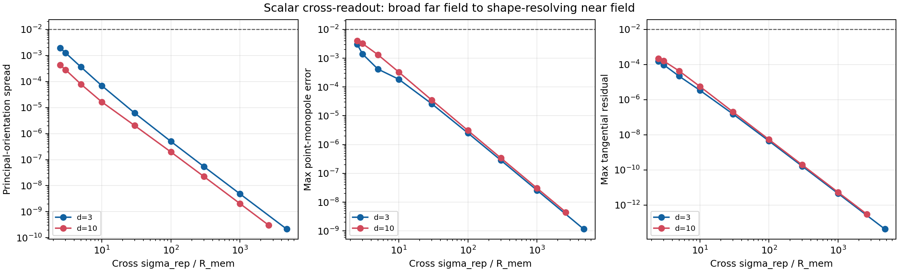

# Scalar cross-readout resolution gate

Date: 2026-07-21T22:36:23+00:00

## Preregistered question

Can an independent instantaneous scalar cross-readout distinguish rigid
orientations of one complete N=100M source checkpoint before source and
target memory clouds overlap? This is an operator-resolution test, not a
dynamical interaction, mediator, synchronization, or particle claim.

Only cross sigma_rep is varied. The source checkpoint and self-dynamics,
sigma_att/sigma_rep, amplitudes, and requested bare centre response
(0.030 R_mem per memory time) remain fixed.
Every row is recalibrated to that response, so cross_eta is not a second
independent scan. The point monopole is the null model.

Primary shape signal: maximum drift difference between principal-axis
orientations divided by point drift. Threshold: 1.0%;
minimum centre distinctness: 1.25 times the
sum of target and source memory radii.

## Decision

Gate status: **fail**.

No audited embedding crosses the static orientation threshold before the distinctness boundary.

Selected next mechanism: **oriented_memory_or_current**.
This selection concerns relational orientation/shape transport. A local
or retarded scalar mediator remains a later option for locality and
propagation-time tests; this gate does not test those properties.

## Results

| d | self | sigma_rep/R | separation/(R_t+R_s) | orientation spread | orientation response/R | point error | eta_cross | calibrated fraction | shape gate |
| ---: | --- | ---: | ---: | ---: | ---: | ---: | ---: | ---: | --- |
| 3 | yes | 4.725e+03 | 2.362e+03 | 2.151e-10 | 6.454e-12 | 1.157e-09 | 2.072e-08 | 0.0300 | fail |
| 3 | no | 1.000e+03 | 500.0000 | 4.819e-09 | 1.446e-10 | 2.577e-08 | 4.383e-09 | 0.0300 | fail |
| 3 | no | 300.0000 | 150.0000 | 5.409e-08 | 1.623e-09 | 2.846e-07 | 1.314e-09 | 0.0300 | fail |
| 3 | no | 100.0000 | 50.0000 | 5.010e-07 | 1.503e-08 | 2.517e-06 | 4.365e-10 | 0.0300 | fail |
| 3 | no | 30.0000 | 15.0000 | 6.124e-06 | 1.838e-07 | 2.618e-05 | 1.296e-10 | 0.0300 | fail |
| 3 | no | 10.0000 | 5.0000 | 6.968e-05 | 2.093e-06 | 1.864e-04 | 4.196e-11 | 0.0300 | fail |
| 3 | no | 5.0000 | 2.5000 | 3.626e-04 | 1.092e-05 | 4.192e-04 | 2.011e-11 | 0.0300 | fail |
| 3 | no | 3.0000 | 1.5000 | 0.0013 | 3.838e-05 | 0.0014 | 1.144e-11 | 0.0300 | fail |
| 3 | no | 2.5000 | 1.2500 | 0.0020 | 5.982e-05 | 0.0031 | 9.303e-12 | 0.0300 | fail |
| 10 | yes | 2.608e+03 | 1.304e+03 | 3.006e-10 | 9.018e-12 | 4.475e-09 | 3.753e-08 | 0.0300 | fail |
| 10 | no | 1.000e+03 | 500.0000 | 2.040e-09 | 6.121e-11 | 3.047e-08 | 1.439e-08 | 0.0300 | fail |
| 10 | no | 300.0000 | 150.0000 | 2.247e-08 | 6.741e-10 | 3.396e-07 | 4.322e-09 | 0.0300 | fail |
| 10 | no | 100.0000 | 50.0000 | 1.973e-07 | 5.919e-09 | 3.083e-06 | 1.444e-09 | 0.0300 | fail |
| 10 | no | 30.0000 | 15.0000 | 2.027e-06 | 6.086e-08 | 3.516e-05 | 4.373e-10 | 0.0300 | fail |
| 10 | no | 10.0000 | 5.0000 | 1.657e-05 | 5.017e-07 | 3.318e-04 | 1.496e-10 | 0.0300 | fail |
| 10 | no | 5.0000 | 2.5000 | 7.948e-05 | 2.478e-06 | 0.0013 | 7.776e-11 | 0.0300 | fail |
| 10 | no | 3.0000 | 1.5000 | 2.834e-04 | 9.502e-06 | 0.0032 | 4.912e-11 | 0.0300 | fail |
| 10 | no | 2.5000 | 1.2500 | 4.315e-04 | 1.521e-05 | 0.0040 | 4.202e-11 | 0.0300 | fail |

## Preliminary onset

| d | self sigma_rep/R | self orientation spread | finite-source onset | orientation onset | max orientation spread |
| ---: | ---: | ---: | ---: | ---: | ---: |
| 3 | 4.725e+03 | 2.151e-10 | none | none | 0.0020 |
| 10 | 2.608e+03 | 3.006e-10 | none | none | 4.315e-04 |

An onset means only that this frozen scalar field can statically
resolve finite extent or orientation at the listed scale. One source
checkpoint per ambient dimension is pipeline evidence, not seed-level
inference. Ratios near the distinctness boundary require an explicit
cloud-overlap check in any later dynamic experiment.

## Mechanism decision

A reproducible orientation onset would justify testing a local or
retarded scalar mediator first: it can transport an already measurable
scalar shape signal without adding internal components. Failure before
overlap would instead prioritize an oriented memory/current channel.
Neither outcome establishes phase, polarization, spin, charge, finite
signal speed, or an external three-dimensional sector.

The next dynamical gate must still preregister at least six independent
formation states, common future noise, channel-off and point-source
controls, bounded source shape, and a stop rule.

## Figure

## Reproducibility

- Analysis revision: a546755806478cb70acea2b229bf886b72fadf3a
- Summary: reports/response/scalar_cross_readout_resolution_2026-07-21.json
- Command: python experiments/current/memory/synchronization/scalar_cross_readout_resolution.py
