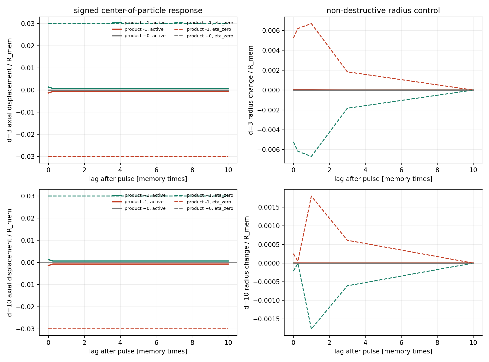

# Signed Scalar Cross-Channel Pilot

Date: 2026-07-18T07:00:20Z.

## Scope

This is a channel-architecture test on frozen scalar-memory checkpoints.
The externally assigned labels s_target and s_source enter only through
their product in the cross force. The established non-negative self-memory
and self-confinement dynamics are unchanged.

The cross potential uses the broad three-scale compensation that enforces
zero spatial integral and exactly matches the local curvature of the
two-scale A_att=35 reference in each ambient dimension.

## Gate Results

| d | A_att cross | A_comp | integral | curvature error | eta_cross | null error | product error | active even/odd | max radius disturbance | pass |
| ---: | ---: | ---: | ---: | ---: | ---: | ---: | ---: | ---: | ---: | --- |
| 3 | 35.08517 | 0.94630 | 0 | 8.88178e-16 | 2.07189e-08 | 0 | 0 | 2.62400e-07 | 4.46025e-05 | True |
| 10 | 35.00002 | 2.06672e-04 | 2.32831e-10 | 4.44089e-16 | 3.75322e-08 | 0 | 0 | 4.75520e-07 | 1.68919e-06 | True |

## Interpretation

- Overall mechanism gate: True.
- The zero-label branches and the explicit free path are bitwise
  identical. Source-zero and target-zero are therefore exact null arms.
- Equal label products generate identical paths, while changing the
  product reverses the pulse response under common future noise.
- Product +1 retains the canonical attractive sign at one sigma_rep;
  product -1 reverses it. This sign convention is explicit and can be
  changed only as a separately declared model choice.
- Passing this test establishes only a mathematically consistent signed
  scalar cross-channel. The labels are assigned inputs, not emergent,
  conserved, quantized, or identified with electric charge.
- One checkpoint per dimension is an architecture validation, not
  seed-level evidence. No reciprocal dynamics or source backreaction
  is present.

## Next Decision

1. Form at least six, preferably ten independent reference states and
   repeat the null/sign/nondestruction gates without retuning.
2. Test the static compensated force at distances below and above its
   force crossing without recalibrating each distance.
3. Only then promote the source to one-way dynamics; reciprocal two-knot
   coupling follows after identity and energy-accounting diagnostics.

## Provenance

- Git revision: 9dc64c2053fe19b43f75d2f452155547be4e9bcf
- Git status at generation: clean
- Checkpoint directory: data/processed/reference_states/scalar_Aatt35_N100M_d3_d10_seed1_2026-07-16
- Script: experiments/current/memory/synchronization/signed_cross_channel_pilot.py
