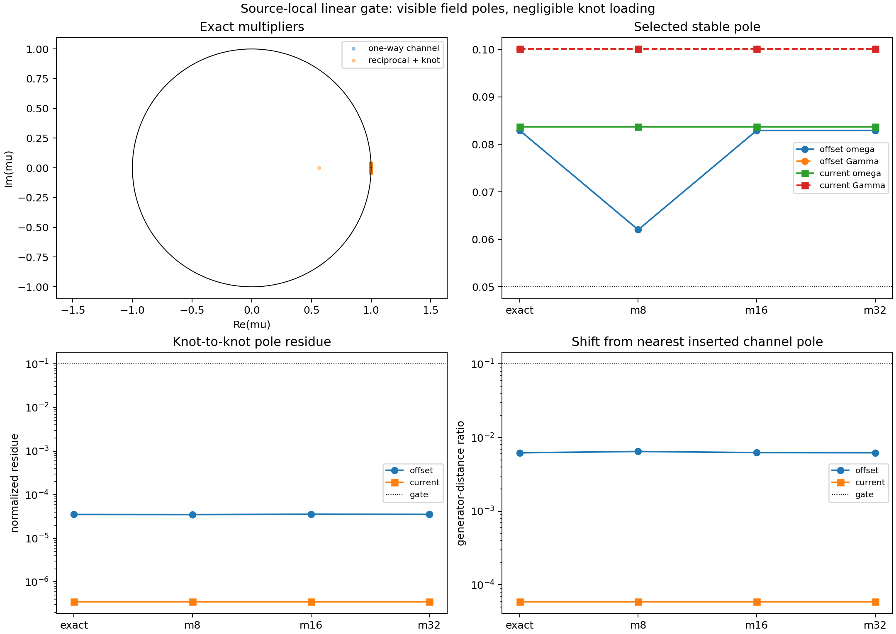

# P3.2c source-local linear emission gate

Date: 2026-08-06T20:01:48.126552+00:00.

## Question

Can a strictly emitter-local scalar signal, transported by the fixed Telegraph channel and read only at the target, create a stable reciprocal pole that is materially loaded into the knot state rather than merely inherited from the channel?

## Model

The translation-free knot coordinate is `d_n=x_n-m_n`, with `d_(n+1)=q(1-g)d_n` when uncoupled. The primary emitter writes `s_n=d_n`; the secondary current writes `s_n=d_n/q-d_(n-1)`. The constant mass source is the zero-dynamics control. None of these source terms contains target position, target memory, pair distance, or an instantaneous cross-gradient.

The exact P3.2 finite-grid Telegraph update and its DC normalization are retained. Reductions keep complete real Telegraph blocks of source/readout-ranked Dirichlet spatial modes, so truncation does not split temporal conjugate pairs.

## Registered gate

A primary pole needs stability, `omega >= 0.05` per memory time, normalized knot residue at least `0.1`, and at least `0.1` relative generator shift from the nearest one-way channel pole. Exact and at least 2/3 modal reductions must pass.

## Result

Classification: **source-local channel stable; reciprocal knot-mode null**.

- exact primary pass: False;
- modal primary passes: 0/3;
- nonlinear 500,000-update confirmation allowed: False;
- mass-control dynamic knot residue: exactly zero by construction.

## Pole diagnostics

| emission | sign | representation | stable | omega | Gamma | knot residue | one-way shift | pass |
| --- | ---: | --- | :---: | ---: | ---: | ---: | ---: | :---: |
| offset | +1 | exact | True | 0.08294 | 0.1001 | 3.54e-05 | 0.006216 | False |
| offset | +1 | modal_8 | True | 0.06202 | 0.1001 | 3.519e-05 | 0.006482 | False |
| offset | +1 | modal_16 | True | 0.08294 | 0.1001 | 3.58e-05 | 0.006251 | False |
| offset | +1 | modal_32 | True | 0.08294 | 0.1001 | 3.554e-05 | 0.006229 | False |
| offset | -1 | exact | True | 0.08462 | 0.1001 | 4.117e-05 | 0.006649 | False |
| offset | -1 | modal_8 | True | 0.08462 | 0.1001 | 4.085e-05 | 0.006621 | False |
| offset | -1 | modal_16 | True | 0.08462 | 0.1001 | 4.07e-05 | 0.00661 | False |
| offset | -1 | modal_32 | True | 0.08462 | 0.1001 | 4.101e-05 | 0.006635 | False |
| current | +1 | exact | True | 0.08374 | 0.1001 | 3.511e-07 | 5.885e-05 | False |
| current | +1 | modal_8 | True | 0.08374 | 0.1001 | 3.511e-07 | 5.886e-05 | False |
| current | +1 | modal_16 | True | 0.08374 | 0.1001 | 3.511e-07 | 5.886e-05 | False |
| current | +1 | modal_32 | True | 0.08374 | 0.1001 | 3.511e-07 | 5.886e-05 | False |
| current | -1 | exact | True | 0.08376 | 0.1001 | 3.516e-07 | 5.889e-05 | False |
| current | -1 | modal_8 | True | 0.08376 | 0.1001 | 3.515e-07 | 5.889e-05 | False |
| current | -1 | modal_16 | True | 0.08376 | 0.1001 | 3.515e-07 | 5.889e-05 | False |
| current | -1 | modal_32 | True | 0.08376 | 0.1001 | 3.516e-07 | 5.889e-05 | False |

## Interpretation

The exact primary arm is stable and contains a non-real pole at `omega=0.08294` and `Gamma=0.1001` per memory time. Its normalized knot residue is only `3.54e-05`, and its generator shift from the nearest one-way Telegraph pole is only `0.006216`. Both are far below the registered `0.1` thresholds.

Thus the complex pair is observable mainly as an inserted channel mode, not as a reciprocal knot mode. The current source loads it even less strongly. The opposite coupling sign does not change that conclusion. Extending this mechanism to 500,000 updates would test duration after the discriminating architecture gate has already failed and is therefore not justified.

## Evidence boundary

Supported: source locality can be enforced, the inherited channel is stable, and its complex poles couple only negligibly to the registered scalar knot coordinate at the fixed gain. Inference: a useful reciprocal mode needs a different source/readout state or an independently derived coupling law. Not supported: physical field identification, charge, spin, photon, dimension selection, Lorentz kinematics, QFT, or a Standard-Model relation.

## Reproducibility

- git revision at execution: `9781727a5654515174d21fac0182aacfed63bf40`;
- preregistration: `reports/project/meta/source_local_linear_gate_preregistration_2026-08-06.md`;
- command: `python experiments/current/memory/synchronization/source_local_linear_gate.py`;
- machine-readable summary: `reports/response/source_local_linear_gate_2026-08-06.json`.
