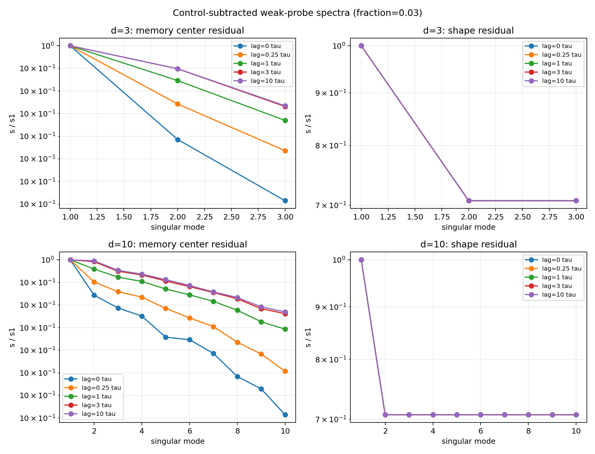
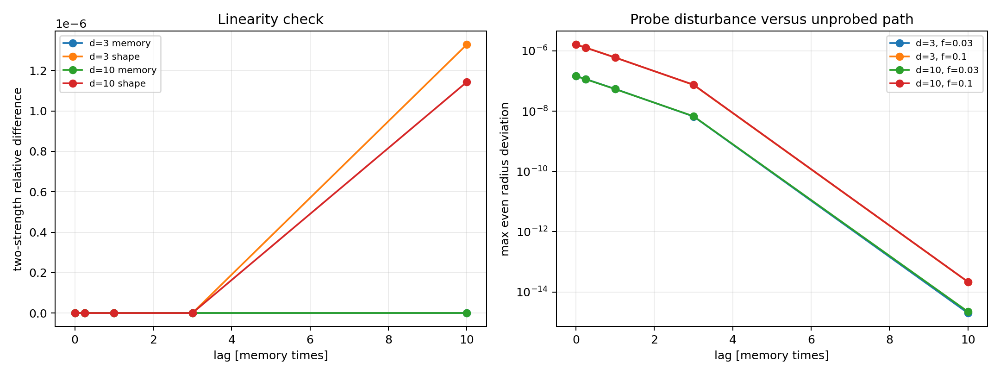

# Weak-Probe Calibration

Generated: `2026-07-16T08:25:08Z`.

## Scope

This report calibrates paired weak external-field response on complete
equilibrated scalar-memory snapshots. It is a measurement-method report,
not evidence for a physical field, interaction charge, or a three-dimensional
external sector.

The probe is a uniform additive drift applied for one memory time. Each
direction uses `+delta`, `-delta`, and an unprobed branch with the same future
noise. An `eta_zero` run measures the bare direct response. Response matrices
below are divided by pulse length, so the exact bare position response is the
identity matrix.

## Inputs

- Ambient dimensions: `[3, 10]`; seeds: `1..5` per dimension.
- Probe displacement fractions of initial memory radius: `[0.03, 0.1]`.
- Pulse duration: `1.0` memory time.
- Response lags: `[0.0, 0.25, 1.0, 3.0, 10.0]` memory times.
- Exact sign-flip inference confidence: `0.90`.
- Initial states: full 600-point memory buffers; no new formation run.

## Pipeline Checks

Maximum normalized error of the `eta_zero` direct position response from the identity: `4.691e-12`.
This verifies the pulse sign, branch pairing, normalization, and common-noise
implementation. The direct position rank is deliberately full ambient rank and
must not be interpreted as an emergent dimension.

## Primary-Fraction Rank Audit

The table uses the smaller probe fraction `0.03`. `energy rank` is the
descriptive 95%-energy rank. `flip rank` requires coherent response across seeds
at the exploratory `90%` exact sign-flip level.

| d | lag/tau | observable | energy rank | flip rank | s1 | s2/s1 | p1 |
| ---: | ---: | --- | ---: | ---: | ---: | ---: | ---: |
| `3` | `0` | `memory_center_residual` | `3` | `3` | `0.351` | `1.000` | `0.062` |
| `3` | `0` | `shape_residual` | `3` | `0` | `2.108e-04` | `0.707` | `0.500` |
| `3` | `0.25` | `memory_center_residual` | `3` | `3` | `0.490` | `1.000` | `0.062` |
| `3` | `0.25` | `shape_residual` | `3` | `0` | `2.513e-04` | `0.707` | `0.438` |
| `3` | `1` | `memory_center_residual` | `3` | `3` | `0.749` | `1.000` | `0.062` |
| `3` | `1` | `shape_residual` | `3` | `0` | `2.916e-04` | `0.707` | `0.250` |
| `3` | `3` | `memory_center_residual` | `3` | `3` | `0.948` | `1.000` | `0.062` |
| `3` | `3` | `shape_residual` | `3` | `0` | `7.967e-05` | `0.707` | `0.312` |
| `3` | `10` | `memory_center_residual` | `3` | `3` | `0.977` | `1.000` | `0.062` |
| `3` | `10` | `shape_residual` | `3` | `0` | `1.031e-11` | `0.707` | `0.500` |
| `10` | `0` | `memory_center_residual` | `10` | `10` | `0.351` | `1.000` | `0.062` |
| `10` | `0` | `shape_residual` | `10` | `0` | `3.518e-04` | `0.707` | `0.812` |
| `10` | `0.25` | `memory_center_residual` | `10` | `10` | `0.490` | `1.000` | `0.062` |
| `10` | `0.25` | `shape_residual` | `10` | `0` | `4.654e-04` | `0.707` | `0.875` |
| `10` | `1` | `memory_center_residual` | `10` | `10` | `0.749` | `1.000` | `0.062` |
| `10` | `1` | `shape_residual` | `10` | `0` | `3.976e-04` | `0.707` | `0.812` |
| `10` | `3` | `memory_center_residual` | `10` | `10` | `0.948` | `1.000` | `0.062` |
| `10` | `3` | `shape_residual` | `10` | `0` | `1.547e-04` | `0.707` | `0.188` |
| `10` | `10` | `memory_center_residual` | `10` | `10` | `0.977` | `1.000` | `0.062` |
| `10` | `10` | `shape_residual` | `10` | `0` | `1.665e-11` | `0.707` | `0.438` |

## Linearity and Stability

Two-strength differences compare derivative-normalized response matrices.
Zero is ideal; values near two indicate incompatible responses.

| d | observable | median relative difference | maximum |
| ---: | --- | ---: | ---: |
| `3` | `memory_center_residual` | `2.344e-12` | `5.914e-12` |
| `3` | `shape_residual` | `4.055e-12` | `5.085e-06` |
| `10` | `memory_center_residual` | `1.449e-12` | `2.730e-12` |
| `10` | `shape_residual` | `1.486e-12` | `2.588e-06` |

The unprobed branch is retained explicitly. The even `(+delta + -delta)/2`
radius displacement against that branch is the first probe-disturbance
diagnostic; it should remain small before a source-knot experiment is trusted.

## Statistical Limit

Five independent seeds yield only 16 unique two-sided singular-value sign
patterns because a global sign is redundant. Therefore the minimum attainable
exact p-value is `1/16 = 0.0625`. A conventional 5% response-rank claim is
impossible with this pilot ensemble. The 90% flip rank is exploratory; the
source-knot validation should use at least six and preferably ten independent
seed states.

## Findings and Decision

The control-subtracted memory-centre response is full ambient rank at every lag: `yes`.
Its smallest observed `s_last/s1` is `1.000`, so the response is
numerically isotropic rather than a hidden low-rank sector. In particular, the
uniform probe returns rank 3 in `d=3` and rank 10 in `d=10`.

The shape response has zero reproducible flip rank at every tested lag: `yes`.
Its largest leading singular value at `10` memory times is only `1.665e-11`.
The descriptive full energy rank of this tiny signal must not be mistaken for a
coherent shape mode.

The largest even radius disturbance over both probe strengths is `1.738e-06`.
Together with the near-zero two-strength differences, this validates fractions
`0.03..0.10` as a linear, non-destructive calibration range for these snapshots.

This is a useful negative control: a uniform field does not reveal a
low-dimensional external sector in the scalar reference model. It also cannot
settle the relational question because its direct forcing spans the supplied
basis by construction. The next experiment is a localized frozen translated
source-knot field, first with cloned states and then with independent seeds.
Its delayed, control-subtracted response is the first physically relevant
response-rank candidate.
