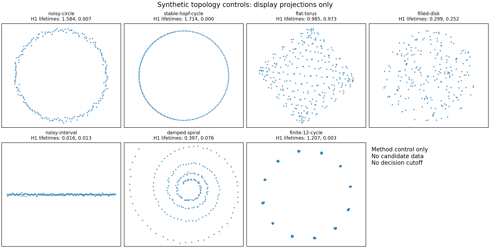

# Candidate-independent S1 topology controls

Date: 2026-08-16.

Status: method development only. This run contains no knot candidate data and
defines no topology threshold, classifier, candidate metric, observable,
embedding, or confirmatory decision.

## Frozen method facts for this control run

- split: method-training
- seed: 20260816
- metric: Euclidean after centering and RMS-radius normalization
- filtration: full-cloud Vietoris-Rips through H1
- coefficient field: F_2
- essential H1 handling: counted separately; no essential class is converted
  into a finite lifetime
- ripser: 0.6.15
- Python: 3.12.13
- numpy: 2.3.5
- matplotlib: 3.10.8
- scipy: 1.17.1
- scikit-learn: 1.9.0

The normalization is a synthetic-control convention, not a candidate
observable contract. A distinct method-validation seed is preassigned, but its
realization is intentionally not generated or inspected here. No cutoff may be
inferred from this single training split.

## Descriptive results

| control | role | n | ambient d | top H1 | second H1 | gap | top share |
|---|---|---:|---:|---:|---:|---:|---:|
| noisy-circle | positive S1-like geometric control | 192 | 2 | 1.5841 | 0.0075 | 1.5766 | 0.9941 |
| stable-hopf-cycle | positive known stable continuous-time limit cycle | 192 | 2 | 1.7141 | 0.0000 | 1.7141 | 1.0000 |
| flat-torus | positive two-generator rival that must not be called one S1 | 289 | 4 | 0.9851 | 0.9732 | 0.0119 | 0.0350 |
| filled-disk | contractible two-dimensional negative control | 224 | 2 | 0.2988 | 0.2517 | 0.0471 | 0.1176 |
| noisy-interval | one-dimensional-with-boundary negative control | 192 | 2 | 0.0161 | 0.0127 | 0.0034 | 0.2508 |
| damped-spiral | transient damped-focus rival | 224 | 2 | 0.3966 | 0.0765 | 0.3202 | 0.2263 |
| finite-12-cycle | semantic rival: circular cloud, but the noiseless invariant set has twelve points rather than topology S1 | 192 | 2 | 1.2068 | 0.0030 | 1.2038 | 0.9845 |

Diagnostics:

- point_order_max_h1_lifetime_error: 0
- circle_top_to_disk_top: 5.30171
- circle_top_to_interval_top: 98.5608
- torus_second_to_circle_second: 130.197
- finite_cycle_top_to_circle_top: 0.761789
- spiral_top_to_circle_top: 0.25039

The raw-cloud point-order permutation is an invariance test: it must leave
persistence unchanged. It is not a negative topology control. The finite
12-cycle is deliberately more dangerous: its cloud can carry a long H1 bar,
but the underlying noiseless invariant set is twelve points, not S1. Persistent
homology therefore cannot by itself distinguish an invariant circle from a
high-period discrete orbit.

The torus control tests a different failure mode. A procedure that reports
only the longest bar can conceal its second independent H1 generator and
mislabel S1 x S1 as one circle. Conversely, the filled disk, interval and
damped spiral show why persistence, intrinsic dimension, boundary, stationarity
and temporal dynamics must remain separate gates.

The figure uses two-dimensional display projections only. Persistence was
computed in the full listed ambient space.

## Decision

This is a software and semantic smoke test, not calibration. It authorizes no
candidate run and supplies no D2 pass threshold. The next candidate-independent
step is to freeze a training-only threshold-selection rule and additional
matched temporal null families; the untouched method-validation split must
then audit that frozen rule. Candidate analysis remains blocked by P0.

Machine-readable record:
[JSON](s1_control_pipeline_2026-08-16.json).

## Reproduction

Run the registered method-training realization and its focused tests with:

    python experiments/current/topology/s1_control_pipeline.py --split method-training
    python -m pytest tests/test_s1_topology_controls.py -q
